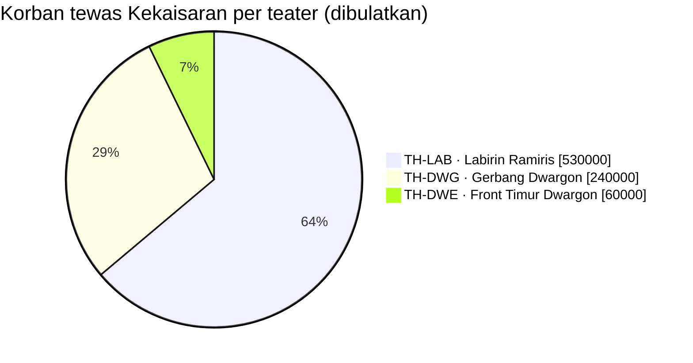
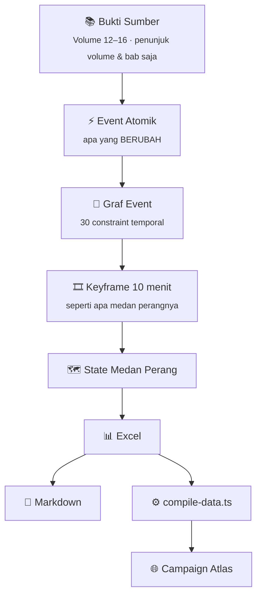
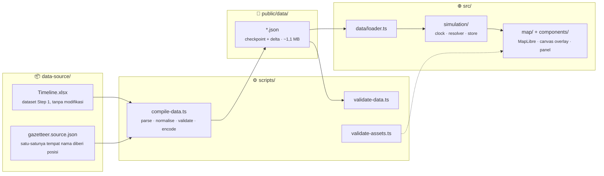

<div align="center">


<a href="#-tentang-proyek">
  
</a>

<br><br>


<br>

**[🎬 Ceritanya](#-tentang-proyek)** ·
**[🕰️ Lima Jam](#️-lima-jam-yang-tidak-boleh-ketuker)** ·
**[🎭 Enam Teater](#-enam-teater-jalan-bareng)** ·
**[🏗️ Arsitektur](#️-arsitektur)** ·
**[🚀 Mulai](#-mulai-dalam-60-detik)** ·
**[🧪 Validasi](#-validasi--build-yang-tidak-bisa-bohong)** ·
**[🗺️ Koordinat](#️-sistem-koordinat-peta)** ·
**[🛟 Troubleshooting](#-troubleshooting)**

</div>

---

## 🎬 Tentang Proyek

Jadi gini ceritanya.

Kekaisaran Timur mengerahkan **940.000 tentara** ke Hutan Besar Jura. Empat hari kemudian,
**770.000** di antaranya sudah tidak ada. Federasi Jura-Tempest kehilangan… **nol**. Secara numerik.

Itu bukan pertempuran. Itu **rekayasa medan perang**. 🧠

Repo ini adalah **rekonstruksi interaktif Perang Tempest–Kekaisaran Timur**: lima puluh hari kampanye,
enam teater, dan **7.200 keyframe** keadaan medan perang — dirender di atas sebuah globe. Dari
mobilisasi sampai perjanjian damai. Satu keyframe setiap 10 menit. Tanpa bolong. Tanpa ngarang. ✨

Proyek ini terdiri dari dua tahap:

<table>
<tr>
<td width="50%" valign="top">

### 🔒 Step 1 — Battlefield Timeline
**Database keadaan medan perang.** Bukan ringkasan cerita, tapi *state* yang bisa langsung dianimasikan.
105 event atomik dirangkai menjadi 7.200 keyframe, lolos 30/30 constraint temporal, dan dikunci.

📁 `Sources of Truth/Timeline Database/`

</td>
<td width="50%" valign="top">

### 🗺️ Step 2 — Campaign Atlas
**Instrumen baca untuk satu dataset.** Aplikasi web (Next.js + MapLibre) yang memutar ulang perang di atas globe:
jam, kamera, dan konvensi gambar — **tidak ada fakta tambahan**.

📁 `src/` · `scripts/` · `public/data/`

</td>
</tr>
</table>

> [!IMPORTANT]
> Aplikasi ini **tidak** menyimulasikan perang, **tidak** menghasilkan outcome, dan **tidak** mengisi celah.
> Semua yang tampil di layar adalah sesuatu yang dinyatakan dataset Step 1, **atau** sesuatu yang diberi label
> oleh antarmuka sebagai rekonstruksi.

<div align="center">
<br>

<br>
<sub><i>Legiun Hijau, kira-kira begini energinya waktu EVT-0102.</i></sub>
<br><br>
</div>

### 🛡️ Tiga Janji — ditegakkan oleh *build*, bukan oleh kesepakatan

| | Janji | Artinya |
|:--:|:--|:--|
| 🌫️ | **Unknown tetap unknown** | Angka yang tidak ada tidak pernah dirender sebagai nol atau diganti taksiran. Korban luka & hilang tidak diketahui untuk kedua pihak sepanjang perang — karena korpusnya tidak pernah menyebutnya. |
| ➗ | **Tidak ada yang dihitung dua kali** | Kekuatan formasi sudah termasuk di induknya; baris korban agregat & komponen hanya mengulang baris lain. Keduanya dikecualikan dari setiap total — dan validator menghitung ulang angka kampanye untuk membuktikannya. |
| 🧭 | **Tidak ada geografi palsu** | Dunianya fiksi. Sistem koordinatnya secara eksplisit adalah koordinat simulasi, dan antarmuka tidak pernah menyajikannya sebagai lintang/bujur. |

> [!TIP]
> **Kenapa 10 menit?** Karena sumbernya (novel) tidak pernah menyebut jam. Sama sekali. Nol.
> Jadi kita tidak berpura-pura punya presisi detik — kita bikin grid yang jujur, lalu biarkan
> renderer yang menghaluskan pada 18–24 FPS. 🎬

---

## 🕰️ Lima Jam yang Tidak Boleh Ketuker

Ini bagian yang paling gampang bikin salah paham, jadi ditulis besar-besar:

```text
Campaign_Time    C+40:06:20               ← dihitung dari mobilisasi
Battle_Time      B+00:06:20               ← dihitung dari kontak pertama
Canonical_Time   "sebulan telah berlalu"  ← apa yang NOVEL bilang
Simulation_Time  06:20                    ← tempelan kita, BUKAN kanon
Calendar_Date    10/02/9001               ← tahun 9001 itu penanda buatan
```

> [!WARNING]
> **Tahun 9001 bukan tanggal in-world.** Korpus tidak memuat satu pun jam atau tanggal kalender.
> Semua `HH:MM` dan setiap tanggal di dataset maupun aplikasi berlabel `SIMULATION_RECONSTRUCTED`,
> dan antarmuka menyatakannya di mana pun ia ditampilkan. Kalau nanti ada yang bilang
> *"novelnya bilang jam 6 pagi"* — tidak, itu kita yang menempatkan. 🙅

---

## 🎭 Enam Teater, Jalan Bareng

Perangnya bukan satu medan. Enam teater punya state sendiri-sendiri dan **tidak pernah saling menimpa**.
Di puncaknya, keenamnya hidup bersamaan dalam satu keyframe.

| Kode | | Teater | Ringkasan |
|:--|:--:|:--|:--|
| `TH-DWG` | 🏔️ | Gerbang Dwargon | 240.000 musnah dalam satu hari |
| `TH-LAB` | 🌀 | Labirin Ramiris | 530.000 musnah di bawah tanah |
| `TH-CAP` | 🏛️ | Ibu Kota Kekaisaran | Kudeta yang gagal sebelum dimulai |
| `TH-DWE` | ⛩️ | Front Timur Dwargon | 60.000 dikorbankan oleh pihaknya sendiri |
| `TH-DRG` | 🐉 | Teater Naga | Veldora vs Velgrynd, buntu |
| `TH-DIP` | 🕊️ | Penyelesaian | Traktat, suksesi, repatriasi |



<sub>Angka di atas dibulatkan per teater untuk visualisasi; angka resmi 830.001 dihitung ulang validator dari baris <code>EVENT_CASUALTY</code> saja.</sub>

---

## 📐 Model Data: Event ≠ Keyframe

Ini aturan paling penting di proyek ini. **Event** bilang *apa yang berubah*. **Keyframe** bilang *seperti apa
rupanya sekarang*. Renderer melakukan interpolasi di antara keyframe — ia **tidak pernah** membuat keyframe baru.



| Parameter | Nilai |
|:--|:--|
| Resolusi | 10 menit in-world = 1 keyframe |
| Frame per jam / per hari | 6 / 144 |
| Total keyframe | **7.200** (50 hari kampanye) |
| Interval checkpoint | 144 frame |
| Kecepatan playback | 0.25× · 0.5× · 1× · 2× · 4× · 8× |

**Movement tidak pernah teleport.** Posisi sebuah pasukan hanya dicatat di tempat dataset menyebut lokasi.
Di antara dua posisi tercatat, ia bergerak kontinu di jalur yang di-*ease*. Kalau dataset tidak memberi posisi —
lompatan ruang-waktu Velgrynd, penempatan di seluruh dunia — pasukan itu **tidak digambar**, dan dossier menjelaskan alasannya.

---

## 🏗️ Arsitektur



**Browser tidak pernah mem-parse spreadsheet.** `scripts/compile-data.ts` adalah satu-satunya file di proyek ini
yang tahu apa itu workbook.

<details>
<summary><b>📂 Tanggung jawab tiap layer</b></summary>
<br>

| Path | Tanggung jawab |
|:--|:--|
| `scripts/compile-data.ts` | Workbook → runtime dataset. Encoding checkpoint & delta. |
| `scripts/validate-data.ts` | Identitas, referensi, urutan, numerik, aritmetika korban. |
| `scripts/validate-assets.ts` | Manifest bendera vs file di disk. |
| `scripts/test-runtime.ts` | Tes runtime resolver & dataset. |
| `scripts/browser-qa.ts` | Menjalankan aplikasi hasil build di browser sungguhan. |
| `src/types/dataset.ts` | Kontrak data runtime, dipakai bersama compiler & aplikasi. |
| `src/lib/coords.ts` | Koordinat simulasi & proyeksi sintetis. |
| `src/simulation/clock.ts` | Satu clock deterministik, di luar React. |
| `src/simulation/resolver.ts` | Seeking state, snapshot pasukan, interpolasi posisi. |
| `src/simulation/store.ts` | Seleksi, layer, view mode, request kamera. |
| `src/map/MapView.tsx` | MapLibre, sumber gambar atlas, poligon teater. |
| `src/map/ForceOverlay.tsx` | Canvas overlay: pasukan, gerakan, pertempuran, event, label. |
| `src/components/` | Panel, dossier, timeline, search, shell. |

</details>

<details>
<summary><b>🗂️ Isi repo (Step 1 + Step 2)</b></summary>
<br>

| File / Folder | Isinya apa | Buat siapa |
|:--|:--|:--|
| 📊 `Tempest_Eastern_Empire_War_Timeline.xlsx` | **Master dataset.** 7.200 keyframe + 11 sheet pendukung | Mesin 🤖 |
| 📖 `Tempest_Eastern_Empire_War_Timeline.md` | Naratif lengkap, audit, register ambiguitas | Manusia 🧍 |
| 🐍 `source_dataset_final.py` | Sumber kebenaran: event, force, casualty, constraint | Developer |
| ⚙️ `keyframe_generator.py` | Bikin grid keyframe dari event | Developer |
| 📝 `markdown_generator.py` | Bikin `.md` dari `.xlsx` (biar nggak pernah beda) | Developer |
| ✅ `validate_temporal.py` | **Jalankan ini setiap habis ngedit!** | Developer |
| 🗂️ `source_dataset_r1/r2/r3.py` | Arsip revisi. Jangan dihapus, ini rantai bukti | Arsip |
| 🧭 `data-source/gazetteer.source.json` | Posisi setiap tempat + grade-nya | Developer |
| 🌐 `src/`, `scripts/`, `public/` | Campaign Atlas (Step 2) | Developer |
| 🏳️ `public/assets/nation-flags/` | Bendera 17 negara | Aset |
| 🗺️ `public/maps/` | Atlas dasar 2641 × 2035 px | Aset |

File Step 1 berada di `Sources of Truth/Timeline Database/`; salinan workbook & Markdown untuk compiler ada di `data-source/`.

</details>

---

## 🚀 Mulai dalam 60 Detik

> [!NOTE]
> Butuh **Node 20.11** atau lebih baru. Tidak ada API key, database, backend, maupun map provider eksternal.

```bash
git clone https://github.com/NuRichter/Tempest_Eastern_Empire_War_Map.git
cd Tempest_Eastern_Empire_War_Map
npm install
npm run compile-data     # regenerate public/data dari workbook
npm run dev              # http://localhost:3000
```

`public/data` adalah hasil generate. Edit workbook atau gazetteer, lalu compile ulang — **jangan pernah** mengedit
JSON hasil generate dengan tangan.

### ⌨️ Keyboard

<div align="center">

| Tombol | Aksi | | Tombol | Aksi |
|:--:|:--|:--:|:--:|:--|
| <kbd>Space</kbd> | Play / pause | | <kbd>/</kbd> | Search |
| <kbd>←</kbd> <kbd>→</kbd> | Mundur / maju 1 jam | | <kbd>c</kbd> | Cinematic mode |
| <kbd>Shift</kbd> + <kbd>←</kbd> <kbd>→</kbd> | Mundur / maju 1 hari | | <kbd>g</kbd> | Globe / flat atlas |
| <kbd>1</kbd> – <kbd>6</kbd> | Kecepatan 0.25× s/d 8× | | <kbd>d</kbd> | Developer readout |
| | | | <kbd>Esc</kbd> | Tutup search & dossier |

</div>

### 🎞️ Loop render, kira-kira begini

```js
for (const frame of keyframes) {
  loadTheatres(frame);        // 6 teater, state independen
  loadForces(frame);          // posisi, kekuatan, status gerak
  loadFrontline(frame);       // garis depan per teater
  loadTerritory(frame);       // siapa menguasai apa
  loadCommand(frame);         // siapa memimpin
  loadCasualties(frame);      // kumulatif, monoton naik
  applyStateChange(frame);
}
// lalu interpolasi antar-keyframe di 18–24 FPS ✨
```

Frontend **tidak perlu** membaca novelnya. Semua sudah jadi state. 💆

### ✅ Aturan Main

| Boleh | Jangan |
|:--|:--|
| ✔️ Interpolasi antar keyframe | ❌ Bikin baris per-frame video |
| ✔️ Tampilkan `UNKNOWN` apa adanya | ❌ Ubah `UNKNOWN` jadi 0 |
| ✔️ Pakai `Approach_Progress_Pct` buat animasi | ❌ Anggap itu jarak terukur |
| ✔️ Tambah event kalau ada bukti sumber | ❌ Ngarang biar animasinya seru |
| ✔️ Jalankan `validate_temporal.py` & `npm run verify` | ❌ Ubah timestamp tanpa cek constraint |
| ✔️ Compile ulang setelah edit workbook | ❌ Edit `public/data` dengan tangan |

---

## 🧪 Validasi — Build yang Tidak Bisa Bohong

```bash
npm run validate-data     # integritas runtime dataset
npm run validate-assets   # aset bendera
npm run lint
npm run typecheck
npm run test              # tes runtime
npm run verify            # semua di atas, lalu build
```

`prebuild` menjalankan compiler dan kedua validator lebih dulu, jadi **sebuah build tidak bisa mengirim dataset
yang belum diperiksa**.

`validate-data` menggagalkan build bila ada: id duplikat, referensi yatim, indeks frame di luar rentang, hari kampanye
atau hari pertempuran yang tidak monoton, indeks dictionary di luar rentang, NaN atau Infinity di mana pun, kuantitas
negatif, koordinat di luar unit square, tempat tanpa basis yang dinyatakan, lingkup korban yang bertentangan dengan
flag eksklusinya sendiri, dan delta stream yang tidak mereproduksi checkpoint.

<table>
<tr>
<td width="50%" valign="top">

#### 🔁 Dual-path replay
Ke-7.200 frame di-resolve **dua kali** — lewat replay berurutan delta stream dari frame nol, dan lewat seek ke
checkpoint terdekat lalu menerapkan delta ke depan. Hasilnya **harus identik**. Kalau berbeda, men-*scrub* timeline
akan menampilkan kampanye yang berbeda dari memutarnya.

</td>
<td width="50%" valign="top">

#### ⚖️ Rekonsiliasi korban
Korban tewas Kekaisaran dihitung ulang dari baris `EVENT_CASUALTY` saja dan **harus berjumlah 830.001** — angka yang
dicapai rekonstruksi Step 1. Guard double-counting yang rusak akan menggagalkan build.

</td>
</tr>
</table>

### 🐍 Sebelum commit perubahan Step 1

```bash
python validate_temporal.py     # 30 constraint, harus 30/30 PASS
python keyframe_generator.py    # rebuild .xlsx
python markdown_generator.py    # rebuild .md dari .xlsx
```

> [!CAUTION]
> Kalau `validate_temporal.py` merah — **jangan di-commit**. Timeline-nya lagi bohong. 🚨

<details>
<summary><b>🤖 Browser QA (Puppeteer)</b></summary>
<br>

Puppeteer sengaja tidak dijadikan dependency wajib; peta perang tidak butuh browser untuk jalan. Pasang hanya saat
ingin menjalankan checklist:

```bash
npm install --no-save puppeteer
npm run build
npm run qa
```

Script ini menyalakan production server di port bebas lalu memeriksa: load, render peta, dataset tersedia, play, pause,
8× vs 1×, deep-link seek, search, dossier, toggle layer, proyeksi globe & flat, cinematic mode, developer readout,
layout sempit, refresh, kebersihan console, dan kebersihan request.

</details>

---

## 📦 Runtime Dataset

`npm run compile-data` menghasilkan `public/data`:

| File | Isi |
|:--|:--|
| `manifest.json` | Clock, batas kampanye, sistem koordinat, checksum sumber, jumlah |
| `timeline.index.json` | Indeks per-frame, dictionary-encoded, untuk scrubber |
| `keyframes.index.json` + `keyframes/checkpoint-NNNN.json` | State penuh setiap 144 frame |
| `state.deltas.json` | Perubahan sparse per-frame |
| `events.json`, `battles.json`, `forces.json`, `force-tracks.json` | Kampanyenya |
| `movement.json` | Gerakan tercatat & key posisi per pasukan |
| `casualties.json` | Catatan korban + total kampanye yang sudah direkonsiliasi |
| `commanders.json`, `combatants.json`, `territories.json` | Referensi |
| `theatres.json`, `places.json`, `nations.json`, `factions.json`, `stages.json` | Geografi & aktor |
| `nation-flags.json` | Id negara → path aset |
| `reference.json` | Kontradiksi & ambiguitas temporal |

<div align="center">

| 📉 Kompresi | |
|:--|--:|
| Baris Timeline | 7.200 |
| Baris force (Army Sizes) | 15.075 |
| Checkpoint state penuh | 50 |
| Frame yang membawa perubahan | **404 (5,6%)** |
| Snapshot pasukan yang di-*inherit* | **91%** |
| Ukuran total runtime dataset | **~1,1 MB** |

</div>

**Seeking.** Me-resolve frame *N* hanya butuh satu pembacaan checkpoint plus paling banyak satu hari simulasi delta.
Lompat dari D+9 ke D−40 **tidak** me-replay seluruh kampanye.

---

## 🗺️ Sistem Koordinat Peta

Dunia Tensura itu fiksi. Ia tidak punya lintang dan bujur, dan tidak ada satu pun bagian proyek ini yang menyiratkan sebaliknya.

**Koordinat simulasi (`SIM_NORMALISED`).** Setiap posisi adalah `x` dan `y` dalam `[0,1]`, diukur terhadap
`public/maps/base-atlas.png` pada resolusi native 2641 × 2035 px. `x` dari kiri ke kanan, `y` dari atas ke bawah.

Dataset Step 1 tidak memuat koordinat sama sekali — ia menyebut tempat dalam prosa. `data-source/gazetteer.source.json`
adalah satu-satunya tempat sebuah nama diberi posisi, dan setiap entri membawa **grade**-nya:

| Grade | Arti |
|:--|:--|
| 🎯 `MEASURED` | Dibaca dari peta beranotasi yang disediakan. Screenshot 1920 × 1080 diregistrasikan ke atlas penuh dengan homografi **SIFT + RANSAC** (385 inlier dari 414 match), lalu piksel ujung tiap pin diambil. Delapan belas negara. |
| 🧩 `RECONSTRUCTED` | Tidak ditandai di peta mana pun. Diposisikan relatif terhadap anchor terukur, dengan penalarannya dicatat di field `basis`. |
| 📐 `SCHEMATIC` | Area operasi teater. Peta yang tersedia tidak memuat batas teater. |
| 🫥 `ABSTRACT` | Sengaja tanpa koordinat — ruang tersegel, negosiasi antarnegara, postur di seluruh dunia, tujuan yang tidak disebut. Tidak digambar di peta. |

Grade ditampilkan di antarmuka, per entitas, di dossier dan di **Intelligence → Coordinates**.

> [!NOTE]
> **Proyeksi sintetis.** Renderer globe butuh koordinat sudut. `src/lib/coords.ts` mendefinisikan satu transformasi
> eksplisit & reversibel: `x` dipetakan linear ke 260° longitude, `y` dipetakan linear ke sumbu vertikal Web Mercator
> sehingga atlas tidak terdistorsi. Sudut itu murni perangkat render internal — tidak pernah dilabeli lintang/bujur
> di antarmuka dan tidak pernah diekspor sebagai data geografis.

---

## 🏳️ Bendera Negara

Bendera ada di repositori, bukan di dataset. Letakkan persis di sini, **termasuk spasinya**:

<details>
<summary><b>🌳 Struktur <code>public/assets/nation-flags/</code></b></summary>
<br>

```text
public/assets/nation-flags/
├── Eastern Empire/
│   └── Flag - Nasca Namrium Ulmeria.png
├── Former Demon Lord Territories/
│   ├── Flag - Beast Kingdom of Eurazania.png
│   ├── Flag - Harpy Queendom of Fulbrosia.png
│   └── Flag - Puppet Nation of Jistav.png
├── Miscellaneous/
│   ├── Flag - Armed Nation of Dwargon.png
│   ├── Flag - Dynasty of Sarion.png
│   └── Flag - Republic of Ulgracia.png
├── Octagram Nations/
│   ├── Flag - City of the Forgotten Dragon.png
│   ├── Flag - Golden City of El Dorado.png
│   ├── Flag - Holy Empire of Lubelius.png
│   ├── Flag - Holy Void of Damargania.png
│   ├── Flag - Ice Continent.png
│   └── Flag - Jura Tempest Federation.png
├── Western Nations/
│   ├── Flag - Kingdom of Blumund.png
│   ├── Flag - Kingdom of Englassia.png
│   ├── Flag - Kingdom of Farmenas.png
│   └── Flag - Kingdom of Siltrosso.png
└── daftar_file.txt          dokumentasi saja, tidak dibaca saat runtime
```

"Various Western States" adalah penanda pengelompokan di peta yang disediakan, bukan negara. Ia tidak punya bendera dan memang tidak diharapkan punya.

</details>

**Menambah bendera baru:**

1. Tambahkan negaranya ke `data-source/gazetteer.source.json` di bawah `nations` — dengan id stabil, nama tampilan, salah satu dari lima kategori, dan posisinya.
2. Compile ulang: `npm run compile-data`. Compiler menulis entri manifest dan menurunkan path aset dari kategori + nama tampilan.
3. Taruh PNG-nya di path yang disebut validator.
4. `npm run validate-assets`.

Komponen tidak pernah merujuk nama file. Mereka merujuk id negara, dan komponen `Flag` me-resolve-nya lewat manifest hasil generate.

> [!IMPORTANT]
> **Bendera yang hilang menggagalkan build** — menyebut negara dan path yang diharapkan. Ini disengaja: diam-diam
> merender warna negara lain berarti memasang bendera palsu di peta sejarah. Untuk preview sebelum aset lengkap:
>
> ```bash
> FLAGS_OPTIONAL=1 npm run build
> ```
>
> Bendera yang hilang akan tampil sebagai ubin bergaris yang menyebut nama negaranya. **Tidak pernah disubstitusi.**

---

## ☁️ Deploy ke Vercel

Aplikasinya adalah frontend statis. Import repositori dan deploy dengan setelan default; Vercel menjalankan
`npm install` lalu `npm run build`, dan `prebuild` meregenerasi serta memvalidasi dataset.

- 🏳️ PNG bendera harus ikut di-commit, atau build sengaja gagal. Set env `FLAGS_OPTIONAL=1` kalau mau deploy sebelum siap.
- 📁 `public/data` boleh di-commit atau di-generate saat build; keduanya sah karena compiler deterministik untuk workbook yang sama.
- 🪟🐧 Path selalu POSIX dan URL aset diturunkan dari `public/`, jadi build di Windows dan di Linux-nya Vercel menghasilkan output yang sama.

---

## 🔍 Yang Jujur Kami Akui

Dataset ini **tidak sempurna**, dan itu ditulis terang-terangan di dalamnya:

- 🌫️ **Jendela 50 hari itu simulasi**, bukan durasi kanon. Novel tidak pernah bilang perangnya berapa lama.
- 🧩 **Titik referensi "sebulan"** adalah interpretasi (`AMB-016`). Kalau salah baca, seluruh fase pendekatan bergeser — walau urutannya tetap.
- 🕳️ **Jeda "beberapa hari"** ke fase kedua dimodelkan tepat 3 hari (`AMB-006`). Ini sambungan terlemah.
- ❓ **Korban luka & hilang tidak diketahui** untuk kedua pihak, di semua fase. Tidak dikarang.
- 🫥 **±170.000 tentara Kekaisaran tidak jelas nasibnya.** Tidak diasumsikan mati.
- 📍 **Formasi yang menumpuk** berbagi anchor karena korpus tidak menyebut posisi yang lebih rinci. Overlay menyebarkan simbolnya di sekitar anchor; posisi sebenarnya identik, dan dossier melaporkan yang asli.

> **Prinsipnya:** kalau sumbernya diam, field-nya `UNKNOWN`.
> **Ketidaktahuan itu data. Karangan itu bug.** 🐛

---

## 🛟 Troubleshooting

<details>
<summary><b>🖤 Peta kosong, atau aplikasi bilang peta tidak bisa dimulai</b></summary>
<br>
Renderer butuh <b>WebGL 2</b>. Aktifkan hardware acceleration, atau buka di browser yang mendukungnya. Antarmuka menyatakan ini secara eksplisit alih-alih menampilkan frame kosong.
</details>

<details>
<summary><b>📭 Dataset kampanye tidak termuat</b></summary>
<br>
<code>public/data</code> hilang atau basi. Jalankan <code>npm run compile-data</code>, lalu <code>npm run validate-data</code>.
</details>

<details>
<summary><b>🏳️ Build gagal menyebut bendera negara yang hilang</b></summary>
<br>
Memang begitu seharusnya. Tambahkan PNG di path yang disebut error, atau pakai <code>FLAGS_OPTIONAL=1</code> untuk preview.
</details>

<details>
<summary><b>📍 Compiler melaporkan lokasi tanpa entri gazetteer</b></summary>
<br>
Ada tempat di workbook yang belum punya posisi. Tambahkan ke <code>aliases</code> di <code>data-source/gazetteer.source.json</code> yang menunjuk ke tempat yang sudah ada, atau tambahkan tempat baru dengan <code>basis</code> yang dinyatakan. Membiarkannya tak terselesaikan juga pilihan sah — pasukannya lalu digambar di luar peta alih-alih di posisi tebakan — tapi compiler akan terus mengingatkan.
</details>

<details>
<summary><b>🔁 Validasi gagal pada delta stream</b></summary>
<br>
Checkpoint dan delta sudah menyimpang, biasanya karena compiler diubah. Compile ulang dan validasi ulang; jangan edit <code>public/data</code> dengan tangan.
</details>

<details>
<summary><b>🧱 Formasi menumpuk satu sama lain</b></summary>
<br>
Mereka berbagi anchor karena korpus tidak menyebut posisi yang lebih rinci. Overlay menyebarkan simbol yang co-located di sekitar anchor bersama; posisi dasarnya identik, dan dossier melaporkan yang sebenarnya.
</details>

Masih buntu? Lihat **[SUPPORT.md](./SUPPORT.md)**.

---

## 🤝 Berkontribusi

Kontribusi sangat diterima — selama mengikuti satu prinsip: **fakta dihormati, ketidaktahuan diakui, karangan tidak diterima.**

- 📜 Baca **[Code of Conduct](./CODE_OF_CONDUCT.md)** sebelum ikut berdiskusi.
- 📚 Setiap fakta baru wajib disertai penunjuk sumber (volume & bab) — **tanpa kutipan verbatim** dari novel.
- 🏷️ Setiap nilai rekonstruksi wajib diberi label.
- ✅ Perubahan penempatan temporal harus lolos `validate_temporal.py` (30/30) dan `npm run verify` sebelum digabungkan.

---

## 📚 Sumber, Provenance & Sitasi

Dataset Step 1 direkonstruksi dari **Tensura volume 12–16**. Proyek ini tidak mereproduksi teks novel. Field bukti
hanya membawa penunjuk volume dan bab, dan antarmuka menampilkannya sebagai provenance — bukan sebagai konten.

Kalau proyek ini kamu pakai untuk riset, skripsi, atau bahan ajar, silakan sitasi lewat tombol
**"Cite this repository"** di sidebar GitHub (dibaca dari **[CITATION.cff](./CITATION.cff)**), dan sebutkan
keterbatasannya sesuai bagian *Limitations* di file `.md` dataset.

---

## ⚖️ Lisensi

Proyek ini memakai **lisensi tiga lapis** — lihat **[LICENSE](./LICENSE)** untuk teks lengkapnya.

| Lapis | Cakupan | Status |
|:--:|:--|:--|
| **A** | Perangkat lunak & skema (kode, generator, validator, struktur kolom) | 🟢 Permisif — termasuk komersial, dengan atribusi |
| **B** | Dataset & tulisan analitis | 🟡 Atribusi · Non-komersial · Berbagi serupa · Wajib menjaga integritas label |
| **C** | Materi pihak ketiga (karya asal, GIF, dll.) | 🔴 **Tidak** dilisensikan oleh proyek ini |

*"Tensei Shitara Slime Datta Ken"* beserta dunia, tokoh, dan teksnya adalah milik pemegang haknya masing-masing.
Proyek penggemar non-komersial ini **tidak berafiliasi** dengan mereka. Belilah dan bacalah edisi resminya. 💛

---

<div align="center">


## 🎉 Datanya sudah dikunci. Petanya sudah hidup.


<br>

*"Semua sudah sesuai rencana."*
— Benimaru, kira-kira, sambil pura-pura kalah 🔥

<br>

**Step 1: 🔒 LOCKED** · **Step 2: 🗺️ Campaign Atlas**

<sub>Dibuat oleh penggemar, untuk penggemar. Fakta dihormati. Ketidaktahuan diakui. Karangan tidak diterima.</sub>


</div>
