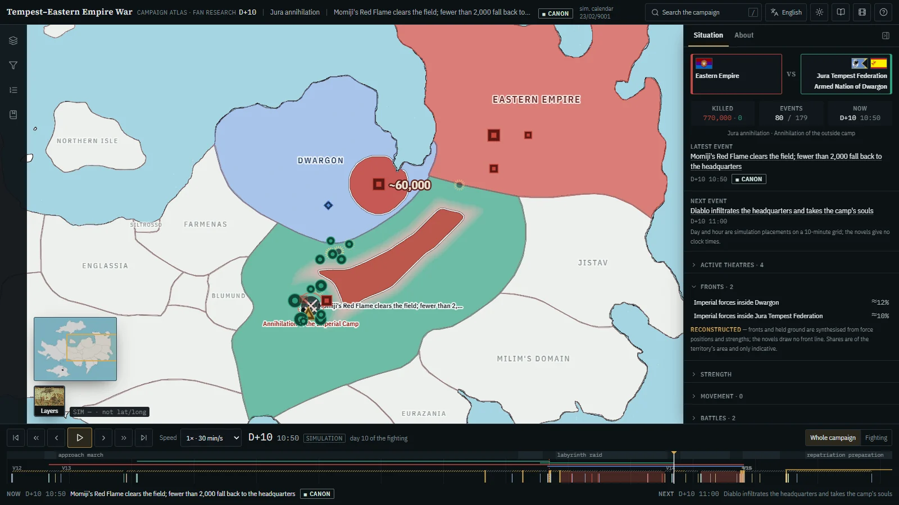
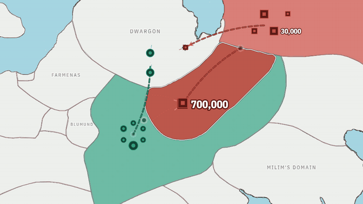
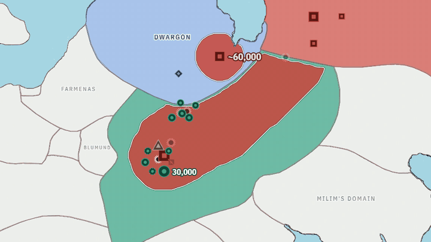
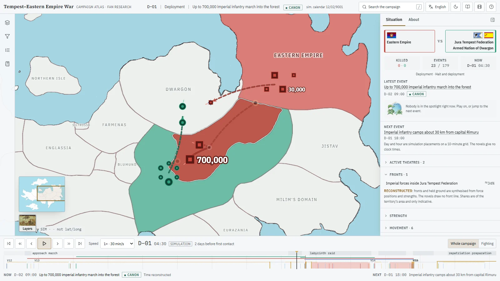
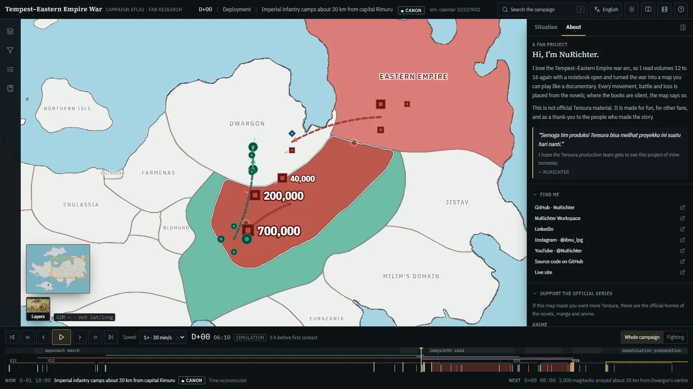
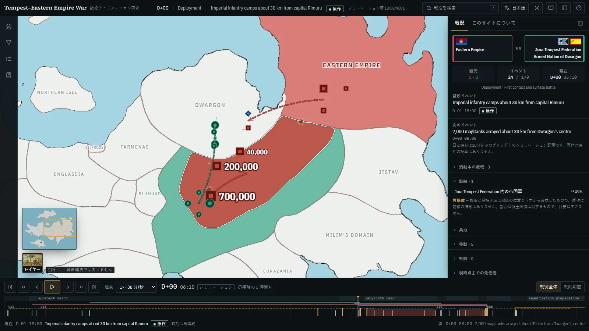
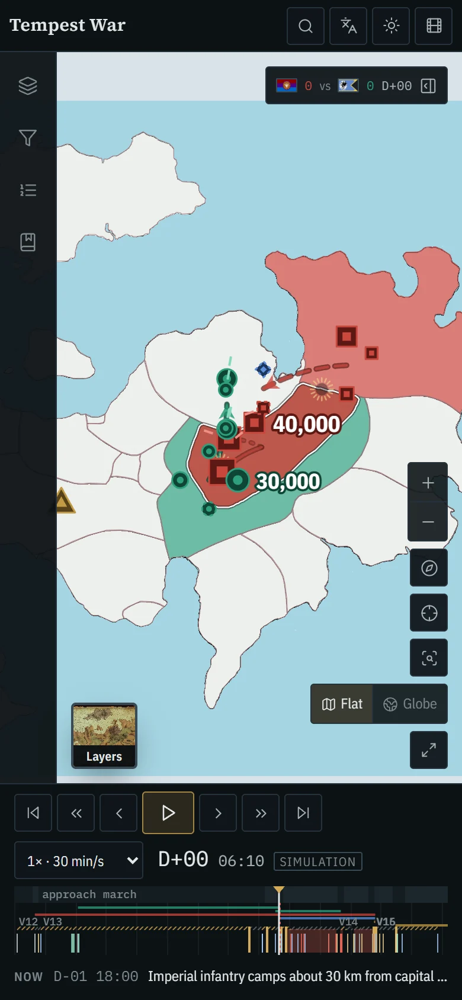
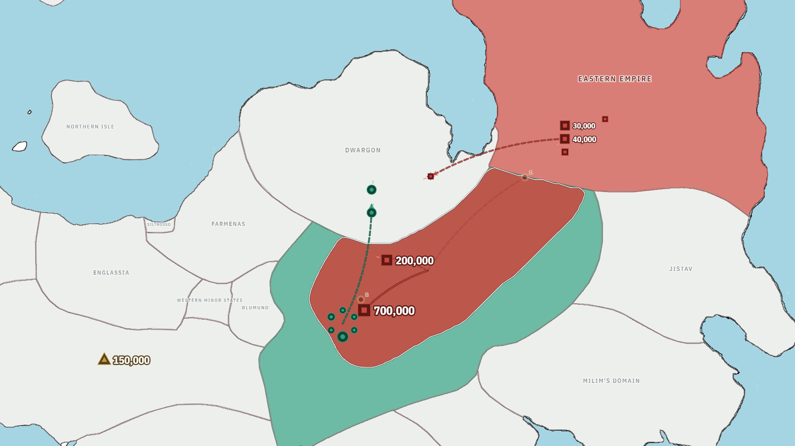
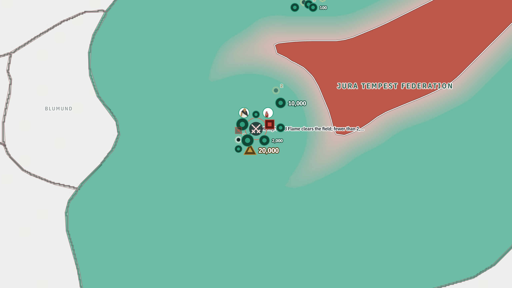
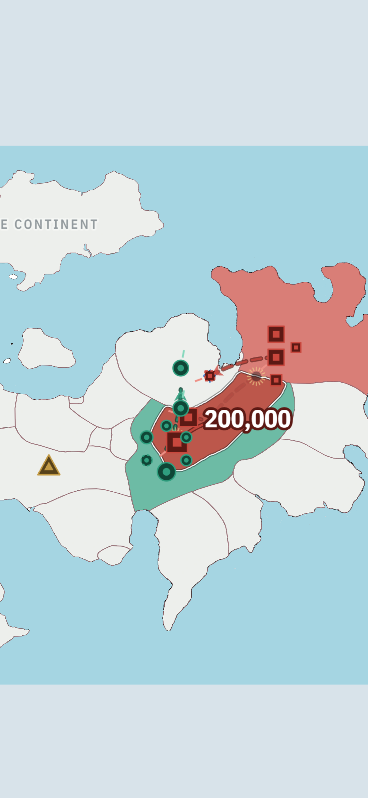

<div align="center">


# Tempest–Eastern Empire War · Campaign Atlas

**Satu perang, sembilan ratus empat puluh ribu prajurit, dan satu bulan yang mengubah peta dunia *Tensura* — sekarang bisa kamu putar seperti film dokumenter.**

[**▶ Buka atlasnya — tempestwar.vercel.app**](https://tempestwar.vercel.app/)




</div>

> [!IMPORTANT]
> **Ini proyek penggemar, bukan materi resmi Tensura.** Dibuat oleh **NuRichter** (NuRichter Workspace) untuk sesama penggemar, menyambut anime musim 4 (2027). Tidak berafiliasi dengan pemegang hak mana pun. Semua yang direkonstruksi — jam, posisi, rute, garis depan — **diberi label** di dalam atlas.

---

## Kenapa peta ini ada

Waktu membaca volume 12 sampai 16, aku selalu ingin melihat perang ini *bergerak*. Rapat perang di ibu kota Kekaisaran. Pawai panjang ke perbatasan. Pertempuran permukaan yang selesai dalam kurang dari dua jam. Labirin yang menelan ratusan ribu prajurit. Lalu satu malam panjang di Dwargon yang hampir membalik segalanya.

Novelnya tidak pernah menggambar garis depan. Jadi aku membaca ulang semuanya dengan buku catatan terbuka. Setiap pergerakan, pertempuran, dan korban ditempatkan dari teks, lalu disusun di satu jam simulasi berlangkah sepuluh menit. Kalau bukunya diam, atlasnya juga bilang begitu.

<div align="center">


<br><sub>Kiri: 700.000 infanteri masuk ke hutan (D−2 → D−1). Kanan: kantong itu runtuh dari tepinya setelah kamp dimusnahkan (D+10). Keduanya direkam langsung dari atlas.</sub>
</div>

## Yang bisa kamu lihat di setiap detik

- **Siapa melawan siapa.** Bendera, warna faksi, dan korban tewas tiap sisi yang bergulir. Saat sebuah peristiwa terjadi, photocard tokohnya muncul berhadapan: A vs B.
- **Apa yang terjadi, di mana, kapan.** Waktunya relatif terhadap hari pertempuran (`D−05`, `D+10`), bukan kalender karangan.
- **Seberapa besar pasukannya**, dan seberapa yakin angka itu: eksplisit, `≈` turunan, `~` rekonstruksi, `?` tidak diketahui.
- **Tanah yang direbut dan hilang.** Garis depan bergerak lewat ruang, dengan sabuk transisi gradien dari warna pucat pihak yang kalah ke warna pemenang.
  - Tanah baru mundur **setelah pertempurannya kalah**, yaitu saat ikon pertempuran disilang.
  - Mundurnya ke arah wilayah asal (status quo).
  - Front Dwargon menempel ke tanah air Kekaisaran, dari garis pantai sampai perbatasan Tempest.
  - Garis depannya bergerigi seperti peta perang sungguhan.
- **Dari mana kita tahu.** Volume, lokator baris, dan kelas provenans di setiap klaim.

<table>
<tr>
<td width="50%"><br><sub><b>Tema terang</b>, setara dengan tema gelap, bukan sekadar dibalik.</sub></td>
<td width="50%"><br><sub><b>About</b>: cerita singkat, tautan resmi seri, dan referensi APA.</sub></td>
</tr>
<tr>
<td><br><sub><b>30 bahasa</b>, termasuk RTL (Arab, Ibrani, Persia, Urdu). Nama tokoh tidak pernah diterjemahkan.</sub></td>
<td align="center"><br><sub><b>Ponsel</b>: situasi tetap terlihat di chip kecil; panel jadi bottom sheet.</sub></td>
</tr>
</table>

## Kanon vs rekonstruksi

Setiap event membawa satu kelas provenans:

| Kelas | Arti |
|---|---|
| `CANONICAL` | Didukung eksplisit oleh novel |
| `CANONICAL_WITH_VISUAL_RECONSTRUCTION` | Kejadiannya kanon; posisi, rute, atau jam di peta direkonstruksi |
| `INFERRED` | Mengikuti dari beberapa petunjuk, tidak dinyatakan |
| `RECONSTRUCTED` | Jembatan antara titik-titik yang diketahui, dibuat proyek ini |
| `UNRESOLVED` | Bukti tidak cukup; tetap ditampilkan supaya celahnya kelihatan |

**Boleh:** interpolasi gerakan di antara dua posisi kanonik, jam simulasi untuk event yang di novel hanya bertanggal hari, dan posisi peta untuk tempat yang tidak ditandai (dengan alasan tertulis).
**Tidak boleh:** mengarang pertempuran, korban, jumlah pasukan, keputusan komandan, atau presisi palsu. Angka yang tidak diketahui tetap **unknown**, tidak pernah menjadi 0.

### Audit sintesis R6

Kelima volume (2.101 halaman PDF) dibaca ulang per adegan. Ada 305 adegan perang yang diekstrak dan 187 event lama yang diperiksa ulang. Koreksi terbesarnya ada di **hitungan hari**:

- Rapat perang Kekaisaran ternyata **D−40**, bukan D−33.
- Pertempuran akhir di kamp jatuh di **D+10**.
- Malam panjang di Dwargon jatuh di **D+15 → D+16**.
- Pertemuan puncak jatuh di **D+19**.

Ada 13 event baru dengan lokator teks, misalnya:

- detour 40 km pasukan Hakuro;
- serangan sayap Shion dan Albis;
- Black Numbers yang terjun ke Legiun;
- front kedua di labirin pada malam panjang.

Ringkasannya ada di [`docs/research/SYNTHESIS_AUDIT.md`](./docs/research/SYNTHESIS_AUDIT.md). Riwayat audit sebelumnya ada di [`docs/audit/timeline-canon-audit.md`](./docs/audit/timeline-canon-audit.md).

## Cara kerja timeline

Novel tidak pernah memberi jam atau tanggal kalender, jadi atlas memakai empat lapisan:

| Lapisan | Contoh | Kanon? |
|---|---|---|
| Waktu kanonik | "kurang dari dua jam setelah dimulai" | Ya, kata-kata novel |
| Hari pertempuran | `D+00` (hari ultimatum dan pertempuran permukaan) | Penempatan, dengan presisi tercatat |
| Jam simulasi | `11:30` | **Bukan**: grid 10 menit, diberi tag *SIMULATION* |
| Kalender | `…/9001` | **Bukan**: penanda buatan |

Kerangka waktunya dibangun dari interval yang dinyatakan novel, seperti "keesokan harinya", "tujuh hari sejak operasi dimulai", dan "malam yang sangat panjang dimulai". Detailnya di [`docs/TIMELINE-METHODOLOGY.md`](./docs/TIMELINE-METHODOLOGY.md).

## Tanah yang bergerak

Atlas ini meniru *cara* empat video perang referensi menggerakkan wilayah. Video-videonya diukur bingkai demi bingkai, dua kali. Hasil yang dipakai:

- **Area yang bergerak, bukan warna yang berganti.** Garis depan adalah isokron `t_flip = T`, jadi bergerak mulus mengikuti jam, berhenti saat dijeda, dan identik saat di-*scrub* mundur.
- **Sabuk transisi.** Di antara warna lama dan warna baru ada sabuk yang ikut bergerak bersama front, dari warna pucat pihak yang kalah ke warna pemenang, dengan garis putih di tepinya. Pilihan *Pale band* (pita pucat datar, gaya video referensi pertama) ada di Layers → Front change.
- **Kebanyakan perubahan kecil, diselingi diam yang panjang.** Ada 22 transisi: 17 di bawah 250 sel, satu besar (runtuhnya kantong Jura, 1.773 sel). Hari-hari tenang memang tenang.
- **Kantong runtuh dari tepi ke dalam**, bagian tengah jatuh terakhir.
- **Perubahan politik** (seluruh wilayah ikut perang) memakai crossfade satu jam simulasi. Hanya itu yang memakai crossfade, sama seperti di referensi.

Semua lapisan ini **RECONSTRUCTED**: disintesis dari posisi, kekuatan, dan nasib setiap formasi, dengan "gerbang" kanon. Bacaan lanjut:

- [`docs/TERRITORIAL-ANIMATION.md`](./docs/TERRITORIAL-ANIMATION.md)
- [`docs/research/TERRITORIAL_RECONSTRUCTION.md`](./docs/research/TERRITORIAL_RECONSTRUCTION.md) (setiap transisi beserta alasannya)
- [`docs/research/REFERENCE_MATCH_AUDIT.md`](./docs/research/REFERENCE_MATCH_AUDIT.md) (skor jujur 1–10)

## Fitur

- **Tur pertama kali.**
  - Saat pertama membuka atlas, muncul tur singkat bergaya pesan *《Notice》* Great Sage, dipandu slime Rimuru.
  - Spotlight-nya meluncur mulus ke tiap bagian layar, dalam 30 bahasa.
  - Bisa diputar ulang dari Layers → *Replay the tour*, atau lewat tautan `?tour=1`.
- **Timeline.**
  - Pita tahap, lajur teater, rentang pertempuran, dan celah waktu berarsir.
  - Bookmark, serta lompat per event, hari, atau frame.
  - Kecepatan 0,25×–48×, dengan *auto-slow* di titik balik.
- **Panel Situasi.** Siapa vs siapa, korban, jumlah event, momen sekarang, event terakhir dengan photocard, lalu bagian sekunder yang bisa dibuka.
- **Dossier saling tertaut.** Untuk pasukan, event, pertempuran, karakter, wilayah, teater, dan pergerakan.
- **Pencarian dan palet perintah.** Buka dengan `/` atau `Ctrl+K`; fuzzy, mengenali alias, dan nama Jepang.
- **Filter.** Faksi, negara, pasukan, pertempuran, wilayah, teater, jenis event, status kanon, dan keyakinan.
- **Ibu kota, kota besar, dan Labirin.**
  - Poligon tiap ibu kota negara, kota-kota besar, dan Labirin Ramiris.
  - Ikonnya: mahkota untuk ibu kota, labirin untuk Labirin, menara untuk kota.
  - Bisa dinyalakan atau dimatikan di Layers.
  - Posisinya diukur dari peta ibu kota, bentuknya direkonstruksi dari deskripsi novel.
  - Kota tidak pernah jatuh di perang ini, jadi wilayah yang direbut selalu mengalir di sekelilingnya.
- **Peta.**
  - Base Map / Myth Map, Flat / Globe.
  - Look Documentary atau War room.
  - Sabuk transisi Gradient atau Pale band.
- **Tampilan.**
  - **Dark / light** dan **30 bahasa** (lihat di bawah).
  - Tema *Tensura*: kursor slime Rimuru (bisa dimatikan di Layers), slime yang memantul di layar loading, dan stiker chibi di panel About dan Situasi.
- **Mode sinematik.** Tanggal besar, satu caption, buku korban, dan kartu penutup.
- **Deep link.** Contoh: `?frame=7697&event=EVT-0214`. Address bar selalu menyimpan momen yang sedang tampil.

**Bahasa:**
English, Bahasa Indonesia, 日本語, 한국어, 简体中文, 繁體中文, Español, Português, Français, Deutsch, Italiano, Nederlands, Русский, Українська, Polski, Türkçe, العربية, हिन्दी, বাংলা, اردو, Tiếng Việt, ไทย, Bahasa Melayu, Filipino, Kiswahili, עברית, فارسی, Română, Čeština, Ελληνικά.

Nama tokoh, negara, dan tempat tidak pernah diterjemahkan (glosarium di [`i18n/glossary.json`](./i18n/glossary.json)). Isi catatan kampanye tetap dalam bahasa Inggris.

<details>
<summary><b>Pintasan keyboard</b></summary>

| Tombol | Aksi | Tombol | Aksi |
|---|---|---|---|
| `Space` | Play / pause | `/` · `Ctrl+K` | Cari & perintah |
| `←` `→` | ±1 jam simulasi | `G` | Flat / globe |
| `Shift` + `←` `→` | ±1 hari | `M` | Base / Myth Map |
| `[` `]` | Event sebelumnya / berikutnya | `L` | Legenda |
| `,` `.` | ±1 keyframe (10 menit) | `C` | Mode sinematik |
| `1`–`8` | Kecepatan | `0` | Bingkai seluruh kampanye |
| `Esc` | Tutup / batal pilih | `?` | Bantuan & pintasan |
| `B` | Bookmark momen ini | | |

</details>

## Wallpaper

**Di dalam atlas** (About → Wallpapers) ada lima wallpaper dari sampul light novel volume 12–16, yaitu volume-volume perang ini. Masing-masing tersedia untuk desktop (1920 × 1080) dan ponsel (1170 × 2532). Seni sampul © Fuse, Mitz Vah / Micro Magazine; hanya untuk layarmu sendiri.

Tiga wallpaper di bawah ini direkam langsung dari atlas, tanpa antarmuka:

<table>
<tr>
<td width="40%"><a href="./assets/readme/wallpapers/wallpaper-1920x1080-advance.png"></a><br><sub>1920 × 1080 · D−1, 700.000 di hutan</sub></td>
<td width="40%"><a href="./assets/readme/wallpapers/wallpaper-2560x1440-collapse.png"></a><br><sub>2560 × 1440 · D+10, kantong runtuh</sub></td>
<td width="20%"><a href="./assets/readme/wallpapers/wallpaper-phone-advance.png"></a><br><sub>Ponsel · 1170 × 2532</sub></td>
</tr>
</table>

## Arsitektur data

```
Sources of Truth/   →   data-source/campaign/   →   compile-data + compile-front   →   public/data   →   atlas
(novel lokal, peta,     (event + efek, pasukan,     (deterministik, tervalidasi)      (checkpoint + delta,
 photocard, bendera)     pergerakan, aturan front)                                     sejarah tanah dikuasai)
```

Detail: [`docs/ARCHITECTURE.md`](./docs/ARCHITECTURE.md) · [`docs/DATA-MODEL.md`](./docs/DATA-MODEL.md) · [`docs/DEPENDENCY-MAP.md`](./docs/DEPENDENCY-MAP.md) · [`docs/RESEARCH-PROVENANCE.md`](./docs/RESEARCH-PROVENANCE.md).

## Menjalankan sendiri

Butuh **Node 20.11+**. Tidak perlu API key, database, atau penyedia peta eksternal.

```bash
git clone https://github.com/NuRichter/Tempest_Eastern_Empire_War_Map.git
cd Tempest_Eastern_Empire_War_Map
npm install
npm run dev            # http://localhost:3000
```

Alat offline (opsional; Python 3 + numpy, opencv-python, Pillow):

```bash
python scripts/cartography/extract_territories.py   # geometri wilayah dari Base Map
python scripts/characters/build_photocards.py       # photocard WebP + thumbnail
python scripts/flags/build_flag_thumbs.py           # thumbnail bendera WebP
python scripts/theme/build_theme_assets.py          # wallpaper, stiker chibi, kursor Rimuru
```

## Validasi & QA

```bash
npm run verify        # compile → validate-data → validate-assets → lint → typecheck → i18n → test → build
npm run qa            # 43 cek di Chromium sungguhan, 8 lebar layar (320–1920 px)
npm run qa:visual     # regresi visual, 10 checkpoint
npm run qa:front      # tangkapan 0/25/50/75/100 % tiap transisi wilayah besar
npm run qa:playback   # front bergerak saat diputar, beku saat dijeda, sama setelah scrub
npm run qa:perf       # waktu siap, transfer, heap, dan seek di 6 perangkat
```

Hasil terakhir:

- `verify`: lulus, termasuk 25/25 tes engine dan 30 bahasa dengan cakupan 100 %.
- `qa`: lulus, 43/43 (termasuk tur pertama kali).
- `qa:visual`: lulus, 10/10.
- `qa:playback`: lulus, 3/3.
- `qa:perf`: muatan pertama sekitar 2,0 MB dalam 51–69 request (sebelumnya 124).

Detail: [`docs/QA.md`](./docs/QA.md).

## Deploy

Frontend statis di Vercel dengan setelan default. `prebuild` meng-compile dan memvalidasi dataset, jadi build tidak bisa mengirim data yang belum diperiksa. Data, peta, dan bahasa dikirim dengan header cache masing-masing (`next.config.mjs`).

## Dukung seri resminya

Kalau peta ini bikin kamu ingin baca atau nonton lagi, ini rumah resminya:

- **Anime:** [ten-sura.com](https://www.ten-sura.com/) · [X @ten_sura_anime](https://x.com/ten_sura_anime) · [Instagram @tensura_official](https://www.instagram.com/tensura_official/) · [TikTok @ten_sura_anime](https://www.tiktok.com/@ten_sura_anime)
- **Light novel:** [Micro Magazine / GC Novels](https://www.ten-sura.com/novel/tensura) · [Yen Press (Inggris)](https://yenpress.com/series/that-time-i-got-reincarnated-as-a-slime-light-novel) · [web novel asli di Shōsetsuka ni Narō](https://ncode.syosetu.com/n6316bn/)
- **Manga:** [Kodansha](https://www.kodansha.co.jp/titles/1000026036) · [baca bab 1 gratis di Magazine Pocket](https://pocket.shonenmagazine.com/title/00380/episode/185457)

Semua tautan dicek pada 8 Oktober 2026. Buktinya ada di [`docs/research/LINKS_VERIFIED.json`](./docs/research/LINKS_VERIFIED.json).

## Referensi

<details>
<summary><b>Daftar pustaka (APA 7)</b></summary>

**Sumber primer**

- Fuse. (2021). *That time I got reincarnated as a slime* (Vol. 12; M. Vah, Illus.; K. Gifford, Trans.). Yen On. (Original work published 2018)
- Fuse. (2022). *That time I got reincarnated as a slime* (Vol. 13; M. Vah, Illus.; K. Gifford, Trans.). Yen On. (Original work published 2018)
- Fuse. (2022). *That time I got reincarnated as a slime* (Vol. 14; M. Vah, Illus.; K. Gifford, Trans.). Yen On. (Original work published 2019)
- Fuse. (2022). *That time I got reincarnated as a slime* (Vol. 15; M. Vah, Illus.; K. Gifford, Trans.). Yen On. (Original work published 2019)
- Fuse. (2023). *That time I got reincarnated as a slime* (Vol. 16; M. Vah, Illus.; K. Gifford, Trans.). Yen On. (Original work published 2020)
- Fuse. (2013–2016). *Tensei shitara suraimu datta ken* [That time I got reincarnated as a slime]. Shōsetsuka ni Narō. https://ncode.syosetu.com/n6316bn/
- Kondō, B. (Executive Producer). (2018–present). *Tensei shitara suraimu datta ken* [That time I got reincarnated as a slime] [TV series]. Eight Bit; Tensura Production Committee.

**Referensi animasi peta**

- k manager. (2025, January 13). *Russian invade Ukraine war every day to January 12th 2025 using Christopher style* [Video]. YouTube. https://www.youtube.com/watch?v=8gUi4-nCBsQ
- mapsinanutshell. (2023, July 20). *The Korean War using Google Earth [Extended]* [Video]. YouTube. https://www.youtube.com/watch?v=lJx6M7SqkvI
- Italian Mapper. (2024, June 19). *World War II every front with army sizes* [Video]. YouTube. https://www.youtube.com/watch?v=nPFk_64JKZ8
- AlterGhz. (2026, May 3). *World War III every day Operation Unthinkable with army sizes* [Video]. YouTube. https://www.youtube.com/watch?v=vOYKWBOB5fw

**Perangkat lunak**

- MapLibre contributors. (2026). *MapLibre GL JS* (Version 5.24.0) [Computer software]. MapLibre. https://maplibre.org/maplibre-gl-js/docs/
- Vercel. (2026). *Next.js* (Version 15.5.25) [Computer software]. https://nextjs.org/docs
- Meta Platforms. (2024). *React* (Version 19.0.0) [Computer software]. https://react.dev/
- Poimandres. (2026). *Zustand* (Version 5.0.15) [Computer software]. https://zustand.docs.pmnd.rs/
- Tailwind Labs. (2025). *Tailwind CSS* (Version 3.4.19) [Computer software]. https://tailwindcss.com/docs
- Google. (2026). *Puppeteer* (Version 25.10.0) [Computer software]. https://pptr.dev/
- Microsoft. (n.d.). *Playwright* [Computer software]. https://playwright.dev/
- OpenCV team. (2026). *OpenCV* (Version 4.14.0) [Computer software]. https://opencv.org/
- FFmpeg developers. (2026). *FFmpeg* [Computer software]. https://ffmpeg.org/
- Artifex Software. (2026). *PyMuPDF* (Version 1.28.2) [Computer software]. https://pymupdf.readthedocs.io/en/latest/
- Vercel. (n.d.). *Deployment protection*. Vercel Documentation. Retrieved October 8, 2026, from https://vercel.com/docs/deployment-protection

</details>

## Berkontribusi

Fakta dihormati, ketidakpastian diakui, karangan tidak diterima. Setiap fakta baru butuh penunjuk sumber (volume, bab, lokator), tanpa kutipan panjang dari novel. Lihat [`docs/CONTRIBUTING.md`](./docs/CONTRIBUTING.md) dan [Code of Conduct](./CODE_OF_CONDUCT.md).

## Lisensi & atribusi

Proyek ini milik **NuRichter** (NuRichter Workspace), dengan lisensi tiga lapis (lihat [LICENSE](./LICENSE)):

- perangkat lunak: permisif;
- dataset dan tulisan analitis: atribusi, non-komersial, berbagi serupa, dan wajib menjaga label integritas;
- materi pihak ketiga: tidak dilisensikan oleh proyek ini.

*Tensei Shitara Slime Datta Ken* beserta dunia, tokoh, teks, dan ilustrasinya adalah milik Fuse, Mitz Vah, Micro Magazine, Kodansha, dan komite produksi anime. Photocard karakter, sampul untuk wallpaper, dan gambar slime Rimuru (stiker dan kursor) berasal dari situs resmi TenSura dan wiki Tensura, sebagaimana tercatat di manifest masing-masing (`Sources of Truth/Character Photocard`, `Sources of Truth/Tensura Theme`). Lisensinya **Open** (keputusan pemilik proyek), dengan sumber tetap dicantumkan.

Teks novel (PDF) tidak disertakan di repositori ini. Audit kanon memakai salinan lokal; rujukannya hanya berupa volume, bab, dan lokator baris. Belilah dan bacalah edisi resminya.

Sitasi: tombol **"Cite this repository"** di GitHub ([CITATION.cff](./CITATION.cff)).

## Pesan dari pembuat

> *Semoga tim produksi Tensura bisa melihat proyekku ini suatu hari nanti.*
>
> — NuRichter

<div align="center">
<br>


**[GitHub](https://github.com/NuRichter)** · **[NuRichter Workspace](https://nurichter-workspace.vercel.app/)** · **[YouTube](https://www.youtube.com/@NuRichter)** · **[Instagram](https://www.instagram.com/ibnu_lpg/)** · **[LinkedIn](https://www.linkedin.com/in/nurichter/)**

<sub>Dibuat oleh penggemar, untuk penggemar. Ketidaktahuan itu data. Karangan itu bug.<br>Kalau suatu hari kamu yang bekerja di balik layar <i>Tensura</i> membaca ini — terima kasih untuk ceritanya.</sub>
</div>
