<div align="center">


<br>

# ⚔️ Tempest × Eastern Empire War

### Campaign Atlas

**Satu perang. 940.000 prajurit. 71 hari. Sekarang bisa kamu putar seperti film dokumenter.**

<sub>Atlas kampanye interaktif untuk Perang Tempest melawan Kekaisaran Timur dari light novel <i>Tensei Shitara Slime Datta Ken</i> (volume 12 sampai 16)</sub>

<br>

<a href="https://tempestwar.vercel.app/"></a>
<a href="https://tempestwar.vercel.app/?tour=1"></a>

<br>


<br>

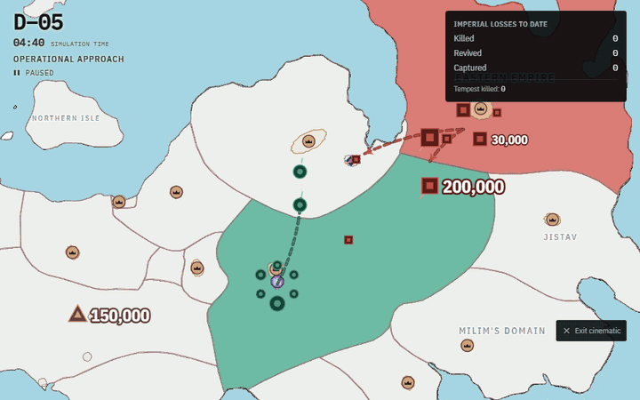

<sub>Seluruh perang dalam satu tarikan napas. Dari pawai ke hutan Jura sampai malam panjang di Dwargon, direkam langsung dari atlas.</sub>

<br><br>

[**Kenapa ada**](#-kenapa-peta-ini-ada) ·
[**Lihat bergerak**](#-lihat-perangnya-bergerak) ·
[**Sinematik**](#-mode-sinematik) ·
[**3D**](#%EF%B8%8F-mode-3d) ·
[**Aturan perang**](#%EF%B8%8F-aturan-perang-di-peta-ini) ·
[**Linimasa**](#%EF%B8%8F-linimasa-perang) ·
[**Tur**](#-tur-pemandu) ·
[**Fitur**](#-semua-fitur) ·
[**Wallpaper**](#%EF%B8%8F-wallpaper) ·
[**Dapur**](#-dapurnya) ·
[**Referensi**](#-referensi)

</div>

<br>

> [!IMPORTANT]
> **Proyek penggemar, bukan materi resmi Tensura.** Dibuat oleh **NuRichter** (NuRichter Workspace) untuk sesama penggemar, menyambut anime musim 4 (2027). Tidak berafiliasi dengan pemegang hak mana pun. Semua yang direkonstruksi, seperti jam, posisi, rute, dan garis depan, **diberi label** di dalam atlas.

<br>

## 📖 Kenapa peta ini ada


Waktu membaca volume 12 sampai 16, aku selalu ingin melihat perang ini **bergerak**. Rapat perang di ibu kota Kekaisaran. Pawai panjang ke perbatasan. Pertempuran permukaan yang selesai dalam kurang dari dua jam. Labirin yang menelan ratusan ribu prajurit. Lalu satu malam panjang di Dwargon yang hampir membalik segalanya.

Novelnya tidak pernah menggambar garis depan. Jadi aku membaca ulang 2.101 halaman dengan buku catatan terbuka, mengekstrak 305 adegan perang, dan menempatkan setiap pergerakan, pertempuran, dan korban di satu jam simulasi berlangkah sepuluh menit.

Kalau bukunya diam, atlasnya juga bilang begitu. Asal lo tau ya, angka yang tidak diketahui di sini tetap **unknown**, tidak pernah jadi nol.

<br clear="right">

<table>
<tr>
<td align="center"><h3>179</h3><sub>event dengan lokator teks</sub></td>
<td align="center"><h3>71 hari</h3><sub>10.224 frame, 10 menit per frame</sub></td>
<td align="center"><h3>57</h3><sub>formasi pasukan</sub></td>
<td align="center"><h3>41</h3><sub>pergerakan berutekan</sub></td>
<td align="center"><h3>9</h3><sub>pertempuran</sub></td>
</tr>
<tr>
<td align="center"><h3>48</h3><sub>transisi wilayah, 3.953 sel</sub></td>
<td align="center"><h3>53</h3><sub>karakter, 41 photocard</sub></td>
<td align="center"><h3>23</h3><sub>ibu kota, kota, dan Labirin</sub></td>
<td align="center"><h3>30</h3><sub>bahasa, 660 teks antarmuka</sub></td>
<td align="center"><h3>18</h3><sub>langkah tur bersama warga Tempest</sub></td>
</tr>
</table>

<br>

<div align="center">

<sub>D+10, 10:50. Kamp Kekaisaran di luar Labirin dimusnahkan. Panel kanan langsung menjawab: siapa melawan siapa, berapa yang gugur, apa yang baru terjadi.</sub>
</div>

<br>

## 🎬 Lihat perangnya bergerak

Atlas ini meniru *cara* empat video perang dokumenter menggerakkan wilayah. Videonya diukur bingkai demi bingkai, dua kali, lalu diterjemahkan jadi aturan. Hasilnya: **area yang bergerak, bukan warna yang berganti.**

<table>
<tr>
<td width="50%"><br><b>D−2 → D−1 · Serbuan ke hutan Jura</b><br><sub>700.000 infanteri masuk. Garis depan merayap ke barat mengikuti barisan pasukan, dengan sabuk transisi gradien di tepinya.</sub></td>
<td width="50%"><br><b>D+10 · Kantong Jura runtuh</b><br><sub>Baru bergerak setelah ikon pertempuran disilang, lalu mundur ke arah perbatasan Kekaisaran. Wilayah yang paling jauh dari rumah lepas lebih dulu.</sub></td>
</tr>
<tr>
<td width="50%">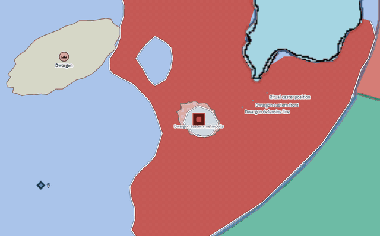<br><b>D+15 → D+16 · Pengepungan Dwargon pecah</b><br><sub>Sabuk pengepungan yang menempel ke tanah air Kekaisaran mundur sampai habis. Legion mendarat dan bertempur, tapi tidak bisa merebut lagi tanah yang sudah hilang.</sub></td>
<td width="50%">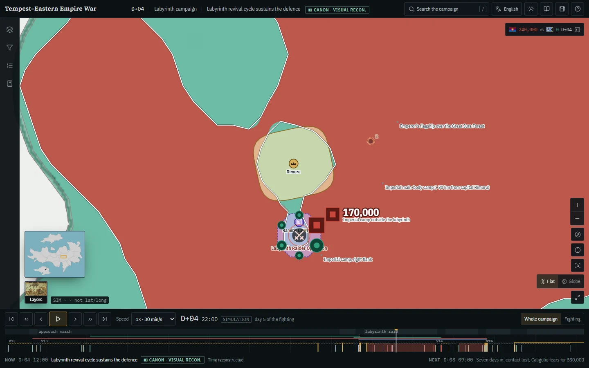<br><b>Kota tidak pernah jatuh</b><br><sub>Rimuru dengan mahkotanya dan Labirin Ramiris bergaris putus-putus. Wilayah Kekaisaran mengalir di sekelilingnya, persis seperti di novel.</sub></td>
</tr>
</table>

<br>

## 🎥 Mode sinematik

Tekan `C` dan kamu pindah dunia. Kilatan cahaya magicule menyapu layar, bar letterbox 2.39:1 menutup, musiknya berganti, lalu **titel pembuka** berjalan: logo *転生したらスライムだった件*, nama serinya, judul ***Eastern Empire Invasion Arc*** yang jatuh huruf demi huruf, dan kredit *Projected by NuRichter in working with NuRichter Workspace*. Setelah itu filmnya jalan sendiri dan kamera diserahkan ke **sutradara**. Intro bisa dilewati dengan tombol atau `Enter`.

<div align="center">
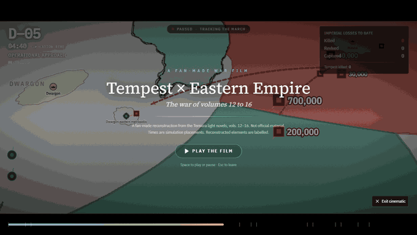
</div>

Sutradaranya membaca perang setiap seperempat detik: event terbaru, pertempuran yang sedang berlangsung, front yang sedang bergeser, dan pasukan yang sedang berbaris. Semua itu dikelompokkan di peta, lalu sutradara memilih **shot**:

| Shot | Kapan | Kamera |
|---|---|---|
| 🎯 **Close** | Satu titik aksi | Mendekat, miring, mengorbit pelan |
| ⚔️ **Battle** | Pertempuran sedang berlangsung | Lebih dekat, lebih curam, berayun di sekitarnya |
| 🌐 **Wide** | Beberapa front sekaligus, misalnya malam panjang | Mundur sampai semua front terbingkai, tenang dan stabil |
| 🐎 **Tracking** | Pasukan sedang berbaris | Mengikuti barisan dengan sedikit mendahului |
| 🌫️ **Aftermath** | Pertempuran baru selesai | Menarik diri perlahan |
| 🏞️ **Establishing** | Tidak ada yang terjadi | Lebar, tinggi, melayang |
| 💥 **Turning point** | Salah satu dari 15 titik balik perang | Menukik cepat dan curam ke lokasinya, di 2D maupun 3D |

**Titik balik.** Saat salah satu dari 15 titik balik tiba (perbatasan dilintasi, ultimatum Testarossa ditolak, Nuclear Flame Ultima, Gravity Collapse Velgrynd, dan seterusnya), layar berkilat, cincin kejut menyebar, bar letterbox merapat seperti potongan film, judul event menghantam layar dengan efek pecah merah dan biru, dan kamera menukik ke tempat kejadiannya. Auto Timing memperlambat film ke 0,5× selama momen itu.

**Kartu event bertumpuk.** Linimasa berjalan cepat, jadi kartu event tidak saling mengganti. Kartu baru masuk dari bawah dan mendorong yang lama ke atas, maksimal empat sekaligus. Setiap kartu bertahan 2 sampai 5 detik sesuai bobotnya (kritis paling lama), dan antrean dilepas satu per satu supaya tetap terbaca.

**Auto Timing.** Filmnya mengatur kecepatannya sendiri: 16× saat persiapan, 8× saat serbuan pertama, melambat ke 2× menjelang pertempuran, dan 1× tepat saat pertempuran berlangsung. Tombolnya ada di atas layar dan bisa dimatikan kapan saja.

**Cold open.** Sebelum film berjalan, empat kalimat pembuka muncul satu per satu, semuanya dari catatan perang: *"D−40. The Empire decides on war."*, *"1,010,002 imperial soldiers will fall."*, *"700,000 of them will rise again."*, *"Tempest will not lose a single soldier."* Setiap kartu bab juga membawa kalimat pemikat dari event terpenting di bab itu.

Kamera tidak pernah melompat. Pusat, zoom, kemiringan, dan arah pandang masing-masing mengikuti pegas teredam kritis yang dihitung persis, jadi gerakannya sama mulusnya di komputer kencang maupun ponsel lambat. Di atasnya ada **kartu bab** di setiap tahap perang, **kartu VS** saat pertempuran dimulai (bendera dan photocard kedua pihak), kartu event yang bertumpuk, buku korban, bingkai viewfinder, dan pita film yang menandai setiap bab. Sentuh peta kapan saja untuk mengambil alih kamera, sutradara kembali beberapa detik kemudian.

<br>

## 🏔️ Mode 3D

Tekan `V` (atau pilih **3D** di sebelah Datar dan Bola dunia) dan seluruh atlas berdiri jadi dunia tiga dimensi, dibangun dengan **three.js**. Mode sinematik memakai panggung yang sama secara default, dengan tombol **2D | 3D** di bagian atas.

<div align="center">
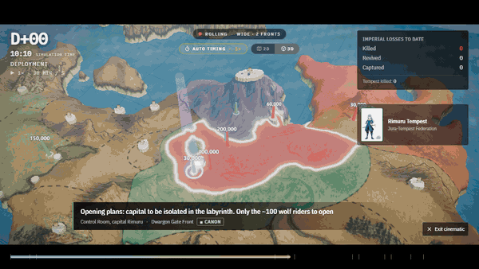
</div>

| | Yang ada di layar |
|:---:|---|
| 🏔️ | **Relief** dengan Myth Map yang di-*super-resolve* sebagai kulitnya. Pegunungan Kanaat berdiri tinggi di sekitar Dwargon. Reliefnya rekonstruksi bergaya, novel tidak memberi ketinggian. |
| 🌊 | **Laut beranimasi** dengan ombak, pantulan langit, dan kilau matahari |
| 🟥 | **Wilayah dan front** dari data yang sama dengan peta 2D, dilukis di atas medan, garis depannya menyala |
| 🗼 | **Pasukan** sebagai pilar bercahaya warna faksi, tingginya mengikuti kekuatan, angkanya melayang di atas |
| 💥 | **Pertempuran** dengan cincin berdenyut, percikan api, dan cahaya kobaran selama berlangsung |
| 👑 | **Ibu kota** sebagai kota 3D bermahkota, **Labirin** sebagai portal ungu dengan pilar cahaya |
| 🌗 | **Siang dan malam mengikuti jam simulasi.** Matahari bergerak sesuai jam, malam panjang D+15 benar-benar terjadi di bawah cahaya bulan |
| 🎥 | **Kamera sutradara** yang sama, diterjemahkan ke orbit 3D |

**Peta lebih HD saat di-zoom.** Base Map berubah jadi vektor (garis pantai dan perbatasan tetap tajam di zoom berapa pun), dan Myth Map dilukis ulang dengan super-resolusi ×4 (FSRCNN) lalu dipotong jadi 609 tile, jadi detailnya bertahan saat didekati.

<br>

## 🎵 Musik, keamanan, dan pencarian

**Dua dunia musik.** Saat menjelajah peta, musik fantasi yang tenang mengalun (*The Old Tower Inn* dan *Great Labyrinth*). Begitu masuk mode sinematik, musiknya berganti jadi skor orkestra (*Fantasy Orchestral Theme*), dan setiap pertempuran memakai musik perang (*Determined Pursuit*, *Battle Theme*) dengan crossfade halus. Semua lagunya berlisensi bebas dari OpenGameArt, **bukan soundtrack resmi Tensura**. Tombol musik ada di bilah atas dan di mode sinematik, shortcut `N`, volumenya di panel Layers. File musik baru diunduh saat diputar dan berhenti saat tab disembunyikan.

**Keamanan.** Content Security Policy ketat (semua dari origin sendiri, tanpa skrip pihak ketiga, tanpa `eval` di produksi, tanpa iframe), HSTS, `X-Frame-Options: DENY`, `nosniff`, Permissions-Policy yang mematikan kamera, mikrofon, dan lokasi, serta `Cross-Origin-Resource-Policy: same-origin` untuk peta, tile, art, dan musik supaya tidak bisa di-hotlink situs lain. Klik kanan dan seret gambar dimatikan di gambar, peta, dan tampilan 3D (wallpaper tetap bisa diunduh karena memang disediakan). Ini penghalang, bukan DRM: apa pun yang tampil di browser tetap bisa direkam layar.

**Ringan di Vercel.** Semua halaman dirender statis saat build dan dilayani dari CDN, jadi tidak ada server function yang berjalan per kunjungan. Aset memakai cache panjang, gaya peta yang tidak terlihat tidak mengunduh apa pun, dan font judul sinematik tidak dimuat sampai dibutuhkan.

**Pencarian.** Judul dan deskripsi baru untuk hasil pencarian, gambar pratinjau 1200×630 untuk media sosial, `sitemap.xml`, `robots.txt`, web manifest, dan data terstruktur schema.org. Verifikasi Google Search Console cukup dengan variabel `NEXT_PUBLIC_GOOGLE_SITE_VERIFICATION` di Vercel.

<br>

## ⚖️ Aturan perang di peta ini

Novel tidak menggambar garis kendali, jadi wilayah yang dikuasai **direkonstruksi** dari posisi, kekuatan, dan nasib setiap formasi. Supaya hasilnya logis seperti perang sungguhan, enam aturan ini dijaga oleh kompiler dan diuji otomatis:

| | Aturan | Artinya di layar |
|:---:|---|---|
| ⚔️ | **Pertempuran menentukan** | Tidak ada yang mundur sebelum pertempurannya selesai. Begitu ikon pertempuran disilang, barulah pihak yang kalah melepas wilayahnya. |
| 🏳️ | **Mundur ke status quo** | Tanah yang lepas surut ke arah wilayah asal pihak yang kalah. Yang paling jauh dari rumah hilang duluan, garis di perbatasan lama paling akhir. |
| 🔒 | **Yang hilang tetap hilang** | Pasukan tidak pernah merebut lagi tanah yang sudah ditinggalkannya. Front tidak maju mundur bolak-balik. |
| 🏰 | **Kota bertahan** | Tidak ada ibu kota, kota, atau Labirin yang jatuh di perang ini. Wilayah yang direbut selalu mengalir di sekelilingnya. |
| 🧱 | **Front Dwargon menempel ke tanah air** | Pengepungan Dwargon digambar sebagai sabuk dari perbatasan Kekaisaran, dari garis pantai sampai perbatasan Tempest, bukan lingkaran di sekitar pasukan. |
| 〰️ | **Garis bergerigi** | Setiap front punya tonjolan, lekukan, dan salient seperti peta perang sungguhan, bukan busur halus atau garis lurus. |

Detail teknis ada di [`docs/TERRITORIAL-ANIMATION.md`](./docs/TERRITORIAL-ANIMATION.md), setiap transisi beserta alasannya di [`docs/research/TERRITORIAL_RECONSTRUCTION.md`](./docs/research/TERRITORIAL_RECONSTRUCTION.md), dan nilai kemiripan yang jujur (skala 1 sampai 10) terhadap video referensi di [`docs/research/REFERENCE_MATCH_AUDIT.md`](./docs/research/REFERENCE_MATCH_AUDIT.md).

<br>

## 🗓️ Linimasa perang

Novel tidak pernah memberi jam atau tanggal kalender. Kerangka waktunya dibangun dari interval yang dinyatakan novel, seperti "keesokan harinya", "tujuh hari sejak operasi dimulai", dan "malam yang sangat panjang dimulai". Hari `D+00` adalah hari ultimatum dan pertempuran permukaan.

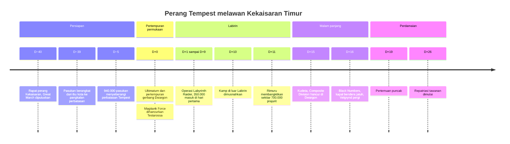

| Lapisan waktu | Contoh | Kanon? |
|---|---|---|
| Waktu kanonik | "kurang dari dua jam setelah dimulai" | ✅ Kata-kata novel |
| Hari pertempuran | `D+00` | 🟡 Penempatan, dengan presisi tercatat |
| Jam simulasi | `11:30` | ❌ Grid 10 menit, diberi tag *SIMULATION* |
| Kalender | `…/9001` | ❌ Penanda buatan |

Ringkasan audit sintesis R6 (5 volume, 2.101 halaman, 305 adegan, 13 event baru, hitungan hari yang dikoreksi) ada di [`docs/research/SYNTHESIS_AUDIT.md`](./docs/research/SYNTHESIS_AUDIT.md).

<br>

## 🧭 Tur pemandu

<div align="center">
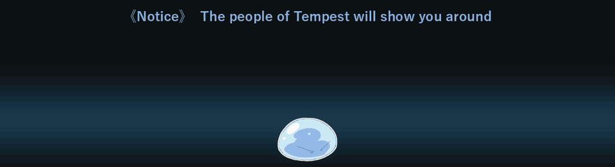
</div>

Saat pertama membuka atlas, muncul tur 18 langkah bergaya pesan **《Notice》** Great Sage. Pemandunya bergantian, masing-masing menjelaskan bagian yang paling cocok dengannya:

| Pemandu | Menunjukkan | Pemandu | Menunjukkan |
|---|---|---|---|
| 🫧 **Rimuru** | Sambutan, bahasa, Layers | 🐺 **Ranga** | Kecepatan putar |
| 👺 **Gobta** | Tombol play | 🌸 **Shuna** | Timeline |
| ⚔️ **Hakurou** | Lompat antar event | 🌿 **Treyni** | Wilayah dan garis depan |
| 🐗 **Geld** | Pasukan dan kekuatannya | 💜 **Shion** | Ikon pertempuran |
| 👑 **Gazel** | Ibu kota dan Labirin | 🦎 **Gabiru** | Kontrol peta |
| 🔥 **Benimaru** | Panel Situasi | 🎀 **Milim** | About dan wallpaper |
| 🗡️ **Souei** | Pencarian | 🐉 **Veldora** | Mode sinematik |

Spotlight-nya meluncur mulus ke setiap tombol. Di langkah peta, tur memindahkan waktu ke momen yang pas lalu menyorot pasukan, ikon pertempuran, dan ibu kota langsung di peta. Selesai tur, waktu dan panelmu kembali seperti semula. Ulangi kapan saja lewat Layers → *Replay the tour*, atau [`?tour=1`](https://tempestwar.vercel.app/?tour=1).

<div align="center">
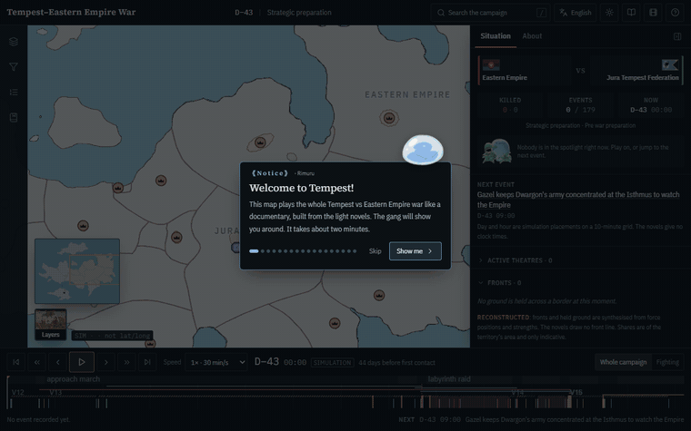
</div>

<br>

## ✨ Semua fitur

<table>
<tr>
<td width="50%" valign="top">

**🗺️ Peta**
- Base Map yang bersih atau Myth Map yang dilukis, keduanya HD saat di-zoom
- Mode 3D three.js dengan relief, laut, siang dan malam
- Datar atau bola dunia, waktu tetap tidak bergeser
- Look *Documentary* atau *War room*
- Sabuk transisi *Gradient* atau *Pale band*
- Poligon ibu kota, kota, dan Labirin dengan ikonnya
- 14 lapisan perang yang bisa dinyalakan satu per satu

**⏱️ Waktu**
- Kecepatan 0,25× sampai 48×, melambat sendiri di titik balik
- Pita tahap, lajur teater, celah waktu berarsir, bookmark
- *Scrub* maju mundur menghasilkan gambar yang identik
- Deep link: `?frame=7697&event=EVT-0214`

</td>
<td width="50%" valign="top">

**🧠 Intelijen**
- Panel Situasi: siapa melawan siapa, korban, event, photocard A vs B
- Dossier untuk pasukan, event, pertempuran, karakter, wilayah, teater
- Pencarian fuzzy dengan alias dan nama Jepang (`/` atau `Ctrl+K`)
- Filter faksi, negara, pasukan, pertempuran, jenis event, status kanon
- Setiap klaim membawa kelas provenans dan lokator sumber

**🎨 Tampilan**
- 30 bahasa, termasuk RTL, nama tokoh tidak pernah diterjemahkan
- Tema gelap dan terang, keduanya kelas satu
- Tema *Tensura*: kursor Rimuru, stiker slime, wallpaper sampul LN
- Mode sinematik dengan kamera sutradara, kartu bab, dan kartu VS
- Ramah ponsel dengan bottom sheet dan chip situasi

</td>
</tr>
</table>

<table>
<tr>
<td width="50%">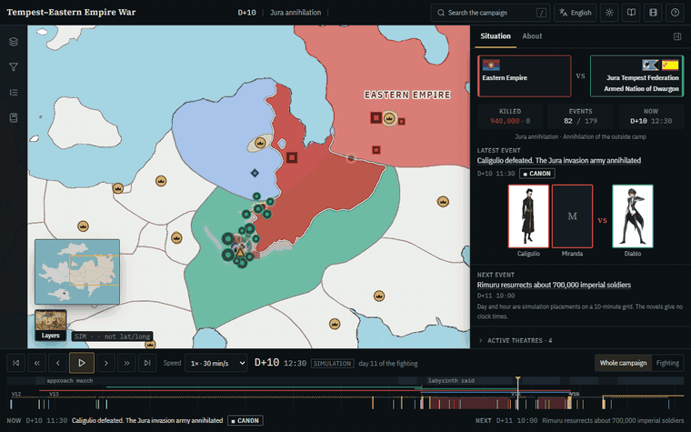<br><sub><b>30 bahasa</b>, dari Indonesia, Jepang, dan Arab (RTL) sampai Swahili dan Yunani.</sub></td>
<td width="50%">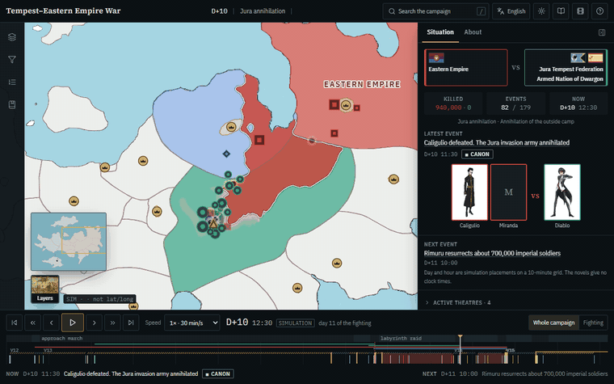<br><sub><b>Gelap dan terang</b>, dengan nilai warnanya sendiri, bukan sekadar dibalik.</sub></td>
</tr>
<tr>
<td width="50%"><br><sub><b>About</b>: cerita singkat, wallpaper, tautan resmi seri, dan referensi APA.</sub></td>
<td width="50%" align="center"><br><sub><b>Ponsel</b>: situasi tetap terlihat di chip kecil.</sub></td>
</tr>
</table>

<details>
<summary><b>⌨️ Pintasan keyboard</b></summary>
<br>

| Tombol | Aksi | Tombol | Aksi |
|---|---|---|---|
| `Space` | Play / pause | `/` · `Ctrl+K` | Cari dan perintah |
| `←` `→` | ±1 jam simulasi | `G` | Datar / bola dunia |
| `Shift` + `←` `→` | ±1 hari | `M` | Base / Myth Map |
| `[` `]` | Event sebelumnya / berikutnya | `L` | Legenda |
| `,` `.` | ±1 frame (10 menit) | `C` | Mode sinematik |
| `1` sampai `8` | Kecepatan | `0` | Bingkai seluruh kampanye |
| `Esc` | Tutup / batal pilih | `?` | Bantuan |
| `B` | Bookmark momen ini | | |

</details>

<details>
<summary><b>🧾 Kanon vs rekonstruksi</b></summary>
<br>

| Kelas | Arti |
|---|---|
| `CANONICAL` | Didukung eksplisit oleh novel |
| `CANONICAL_WITH_VISUAL_RECONSTRUCTION` | Kejadiannya kanon, posisi, rute, atau jam di peta direkonstruksi |
| `INFERRED` | Mengikuti dari beberapa petunjuk, tidak dinyatakan |
| `RECONSTRUCTED` | Jembatan antara titik-titik yang diketahui, dibuat proyek ini |
| `UNRESOLVED` | Bukti tidak cukup, tetap ditampilkan supaya celahnya kelihatan |

**Boleh:** interpolasi gerakan di antara dua posisi kanonik, jam simulasi untuk event yang di novel hanya bertanggal hari, dan posisi peta untuk tempat yang tidak ditandai (dengan alasan tertulis).

**Tidak boleh:** mengarang pertempuran, korban, jumlah pasukan, keputusan komandan, atau presisi palsu.

</details>

<br>

## 🖼️ Wallpaper

Lima sampul light novel volume 12 sampai 16, yaitu volume-volume perang ini, diolah jadi wallpaper desktop dan ponsel. Unduh langsung di atlas (About → Wallpapers) atau di sini. <sub>Seni sampul © Fuse, Mitz Vah / Micro Magazine, hanya untuk layarmu sendiri.</sub>

<table>
<tr>
<td align="center"><a href="./public/assets/theme/wallpapers/vol-12-desktop.jpg">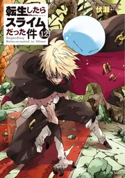</a><br><sub><b>Vol. 12</b><br><a href="./public/assets/theme/wallpapers/vol-12-desktop.jpg">Desktop</a> · <a href="./public/assets/theme/wallpapers/vol-12-phone.jpg">Ponsel</a></sub></td>
<td align="center"><a href="./public/assets/theme/wallpapers/vol-13-desktop.jpg">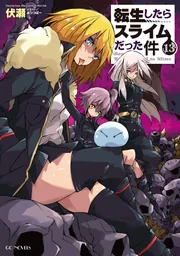</a><br><sub><b>Vol. 13</b><br><a href="./public/assets/theme/wallpapers/vol-13-desktop.jpg">Desktop</a> · <a href="./public/assets/theme/wallpapers/vol-13-phone.jpg">Ponsel</a></sub></td>
<td align="center"><a href="./public/assets/theme/wallpapers/vol-14-desktop.jpg">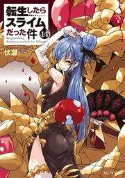</a><br><sub><b>Vol. 14</b><br><a href="./public/assets/theme/wallpapers/vol-14-desktop.jpg">Desktop</a> · <a href="./public/assets/theme/wallpapers/vol-14-phone.jpg">Ponsel</a></sub></td>
<td align="center"><a href="./public/assets/theme/wallpapers/vol-15-desktop.jpg">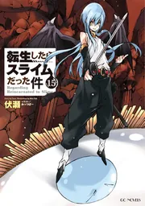</a><br><sub><b>Vol. 15</b><br><a href="./public/assets/theme/wallpapers/vol-15-desktop.jpg">Desktop</a> · <a href="./public/assets/theme/wallpapers/vol-15-phone.jpg">Ponsel</a></sub></td>
<td align="center"><a href="./public/assets/theme/wallpapers/vol-16-desktop.jpg"></a><br><sub><b>Vol. 16</b><br><a href="./public/assets/theme/wallpapers/vol-16-desktop.jpg">Desktop</a> · <a href="./public/assets/theme/wallpapers/vol-16-phone.jpg">Ponsel</a></sub></td>
</tr>
</table>

Dan tiga yang direkam langsung dari atlas, tanpa antarmuka:

<table>
<tr>
<td width="40%"><a href="./assets/readme/wallpapers/wallpaper-1920x1080-advance.png"></a><br><sub>1920 × 1080 · D−1, 700.000 di hutan</sub></td>
<td width="40%"><a href="./assets/readme/wallpapers/wallpaper-2560x1440-collapse.png"></a><br><sub>2560 × 1440 · D+10, kantong runtuh</sub></td>
<td width="20%"><a href="./assets/readme/wallpapers/wallpaper-phone-advance.png"></a><br><sub>Ponsel · 1170 × 2532</sub></td>
</tr>
</table>

<br>

## 🔧 Dapurnya

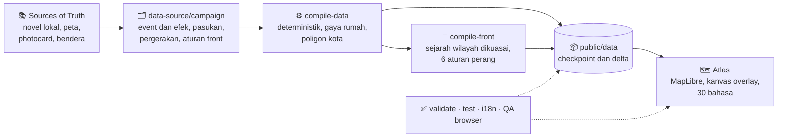

<details>
<summary><b>🚀 Menjalankan sendiri</b></summary>
<br>

Butuh **Node 20.11+**. Tidak perlu API key, database, atau penyedia peta eksternal.

```bash
git clone https://github.com/NuRichter/Tempest_Eastern_Empire_War_Map.git
cd Tempest_Eastern_Empire_War_Map
npm install
npm run dev            # http://localhost:3000
```

Alat offline (opsional, Python 3 dengan numpy, opencv-python, Pillow):

```bash
python scripts/cartography/extract_territories.py   # geometri wilayah dari Base Map
python scripts/characters/build_photocards.py       # photocard WebP dan thumbnail
python scripts/flags/build_flag_thumbs.py           # thumbnail bendera WebP
python scripts/theme/build_theme_assets.py          # wallpaper, stiker, pemandu tur, kursor
python scripts/cartography/build_hd_maps.py --model FSRCNN_x4.pb   # tile HD, garis pantai vektor, relief 3D
```

</details>

<details>
<summary><b>🧪 Validasi dan QA</b></summary>
<br>

```bash
npm run verify        # compile, validate-data, validate-assets, lint, typecheck, i18n, test, build
npm run qa            # 43 cek di Chromium sungguhan, 8 lebar layar (320 sampai 1920 px)
npm run qa:visual     # regresi visual, 10 checkpoint
npm run qa:front      # tangkapan 0/25/50/75/100 % tiap transisi wilayah besar
npm run qa:playback   # front bergerak saat diputar, beku saat dijeda, sama setelah scrub
npm run qa:perf       # waktu siap, transfer, heap, dan seek di 6 perangkat
```

Hasil terakhir: `verify` lulus (25/25 tes engine, 30 bahasa 100 %), `qa` 43/43 termasuk tur, `qa:visual` 10/10, `qa:playback` 3/3. Muatan pertama sekitar 2,0 MB dalam 51 sampai 69 request. `validate-data` dan `i18n:check` juga menolak em dash dan titik koma di semua teks yang tampil di situs. Detail di [`docs/QA.md`](./docs/QA.md).

</details>

<details>
<summary><b>📚 Dokumentasi</b></summary>
<br>

| Dokumen | Isi |
|---|---|
| [`ARCHITECTURE.md`](./docs/ARCHITECTURE.md) | Modul runtime, loop render, model frame dan delta |
| [`DATA-MODEL.md`](./docs/DATA-MODEL.md) | Bentuk setiap file data |
| [`TERRITORIAL-ANIMATION.md`](./docs/TERRITORIAL-ANIMATION.md) | Mesin wilayah dan aturan perangnya |
| [`CARTOGRAPHY.md`](./docs/CARTOGRAPHY.md) | Wilayah, ibu kota, kota, Labirin |
| [`UI-DESIGN.md`](./docs/UI-DESIGN.md) | Anatomi layar dan tur |
| [`TIMELINE-METHODOLOGY.md`](./docs/TIMELINE-METHODOLOGY.md) | Cara jam dan hari ditempatkan |
| [`research/`](./docs/research/) | Forensik video, audit sintesis, audit kemiripan |
| [`DEPENDENCY-MAP.md`](./docs/DEPENDENCY-MAP.md) | Asal setiap file dan siapa yang membacanya |

</details>

<br>

## 💙 Dukung seri resminya

Kalau peta ini bikin kamu ingin baca atau nonton lagi, ini rumah resminya:

| | Tautan |
|---|---|
| 📺 **Anime** | [ten-sura.com](https://www.ten-sura.com/) · [X @ten_sura_anime](https://x.com/ten_sura_anime) · [Instagram @tensura_official](https://www.instagram.com/tensura_official/) · [TikTok @ten_sura_anime](https://www.tiktok.com/@ten_sura_anime) |
| 📗 **Light novel** | [Micro Magazine / GC Novels](https://www.ten-sura.com/novel/tensura) · [Yen Press (Inggris)](https://yenpress.com/series/that-time-i-got-reincarnated-as-a-slime-light-novel) · [web novel asli di Shōsetsuka ni Narō](https://ncode.syosetu.com/n6316bn/) |
| 📘 **Manga** | [Kodansha](https://www.kodansha.co.jp/titles/1000026036) · [baca bab 1 gratis di Magazine Pocket](https://pocket.shonenmagazine.com/title/00380/episode/185457) |

<sub>Semua tautan dicek pada 8 Oktober 2026. Buktinya ada di <a href="./docs/research/LINKS_VERIFIED.json"><code>docs/research/LINKS_VERIFIED.json</code></a>.</sub>

<br>

## 📜 Referensi

<details>
<summary><b>Daftar pustaka (APA 7)</b></summary>
<br>

**Sumber primer**

- Fuse. (2021). *That time I got reincarnated as a slime* (Vol. 12, M. Vah, Illus., K. Gifford, Trans.). Yen On. (Original work published 2018)
- Fuse. (2022). *That time I got reincarnated as a slime* (Vol. 13, M. Vah, Illus., K. Gifford, Trans.). Yen On. (Original work published 2018)
- Fuse. (2022). *That time I got reincarnated as a slime* (Vol. 14, M. Vah, Illus., K. Gifford, Trans.). Yen On. (Original work published 2019)
- Fuse. (2022). *That time I got reincarnated as a slime* (Vol. 15, M. Vah, Illus., K. Gifford, Trans.). Yen On. (Original work published 2019)
- Fuse. (2023). *That time I got reincarnated as a slime* (Vol. 16, M. Vah, Illus., K. Gifford, Trans.). Yen On. (Original work published 2020)
- Fuse. (2013–2016). *Tensei shitara suraimu datta ken* [That time I got reincarnated as a slime]. Shōsetsuka ni Narō. https://ncode.syosetu.com/n6316bn/
- Kondō, B. (Executive Producer). (2018–present). *Tensei shitara suraimu datta ken* [That time I got reincarnated as a slime] [TV series]. Eight Bit, Tensura Production Committee.

**Referensi animasi peta**

- k manager. (2025, January 13). *Russian invade Ukraine war every day to January 12th 2025 using Christopher style* [Video]. YouTube. https://www.youtube.com/watch?v=8gUi4-nCBsQ
- mapsinanutshell. (2023, July 20). *The Korean War using Google Earth [Extended]* [Video]. YouTube. https://www.youtube.com/watch?v=lJx6M7SqkvI
- Italian Mapper. (2024, June 19). *World War II every front with army sizes* [Video]. YouTube. https://www.youtube.com/watch?v=nPFk_64JKZ8
- AlterGhz. (2026, May 3). *World War III every day Operation Unthinkable with army sizes* [Video]. YouTube. https://www.youtube.com/watch?v=vOYKWBOB5fw

**Perangkat lunak**

- MapLibre contributors. (2026). *MapLibre GL JS* (Version 5.24.0) [Computer software]. MapLibre. https://maplibre.org/maplibre-gl-js/docs/
- Vercel. (2026). *Next.js* (Version 15.5.25) [Computer software]. https://nextjs.org/docs
- Meta Platforms. (2024). *React* (Version 19.0.0) [Computer software]. https://react.dev/
- Poimandres. (2026). *Zustand* (Version 5.0.15) [Computer software]. https://zustand.docs.pmnd.rs/
- Tailwind Labs. (2025). *Tailwind CSS* (Version 3.4.19) [Computer software]. https://tailwindcss.com/docs
- Google. (2026). *Puppeteer* (Version 25.10.0) [Computer software]. https://pptr.dev/
- Microsoft. (n.d.). *Playwright* [Computer software]. https://playwright.dev/
- OpenCV team. (2026). *OpenCV* (Version 4.14.0) [Computer software]. https://opencv.org/
- FFmpeg developers. (2026). *FFmpeg* [Computer software]. https://ffmpeg.org/
- three.js authors. (2026). *three.js* (Version 0.186.1) [Computer software]. https://threejs.org/
- Dong, C., Loy, C. C., & Tang, X. (2016). Accelerating the super-resolution convolutional neural network. In *Computer Vision, ECCV 2016* (pp. 391–407). Springer.
- Artifex Software. (2026). *PyMuPDF* (Version 1.28.2) [Computer software]. https://pymupdf.readthedocs.io/en/latest/
- Vercel. (n.d.). *Deployment protection*. Vercel Documentation. Retrieved October 8, 2026, from https://vercel.com/docs/deployment-protection

</details>

<br>

## ⚖️ Lisensi dan atribusi

Proyek ini milik **NuRichter** (NuRichter Workspace), dengan lisensi tiga lapis (lihat [LICENSE](./LICENSE)):

- **Perangkat lunak:** permisif.
- **Dataset dan tulisan analitis:** atribusi, non-komersial, berbagi serupa, dan wajib menjaga label integritas.
- **Materi pihak ketiga:** tidak dilisensikan oleh proyek ini.

*Tensei Shitara Slime Datta Ken* beserta dunia, tokoh, teks, dan ilustrasinya adalah milik Fuse, Mitz Vah, Micro Magazine, Kodansha, dan komite produksi anime. Photocard karakter, sampul untuk wallpaper, gambar slime Rimuru (stiker dan kursor), dan gambar karakter *Slime Diaries* untuk pemandu tur berasal dari situs resmi TenSura dan wiki Tensura, sebagaimana tercatat di manifest masing-masing (`Sources of Truth/Character Photocard`, `Sources of Truth/Tensura Theme`). Logo seri di intro sinematik juga berasal dari wiki Tensura. Lisensinya **Open** (keputusan pemilik proyek), dengan sumber tetap dicantumkan.

Musik latar berasal dari OpenGameArt: *Medieval: The Old Tower Inn* oleh RandomMind (CC0), *Great Labyrinth* oleh Mintodog dan Jonathan Shaw, mix oleh glitchart (CC-BY 3.0), *Fantasy Orchestral Theme* oleh Joth (CC0), *Determined Pursuit* oleh Emma_MA (CC0), dan *Battle Theme* oleh Wolfgang_ (CC0). Sumber lengkapnya ada di `Sources of Truth/Music/manifest.json` dan di panel About.

Teks novel (PDF) tidak disertakan di repositori ini. Audit kanon memakai salinan lokal, dan rujukannya hanya berupa volume, bab, dan lokator baris. Belilah dan bacalah edisi resminya.

Sitasi: tombol **"Cite this repository"** di GitHub ([CITATION.cff](./CITATION.cff)). Ingin ikut menyumbang? Fakta dihormati, ketidakpastian diakui, karangan tidak diterima. Lihat [`docs/CONTRIBUTING.md`](./docs/CONTRIBUTING.md) dan [Code of Conduct](./CODE_OF_CONDUCT.md).

<br>

## 💌 Pesan dari pembuat

<div align="center">


### *"Semoga tim produksi Tensura bisa melihat proyekku ini suatu hari nanti."*

**NuRichter**

<br>


<br><br>

[**GitHub**](https://github.com/NuRichter) · [**NuRichter Workspace**](https://nurichter-workspace.vercel.app/) · [**YouTube**](https://www.youtube.com/@NuRichter) · [**Instagram**](https://www.instagram.com/ibnu_lpg/) · [**LinkedIn**](https://www.linkedin.com/in/nurichter/)

<sub>Dibuat oleh penggemar, untuk penggemar. Ketidaktahuan itu data. Karangan itu bug.<br>Kalau suatu hari kamu yang bekerja di balik layar <i>Tensura</i> membaca ini, terima kasih untuk ceritanya.</sub>

</div>
